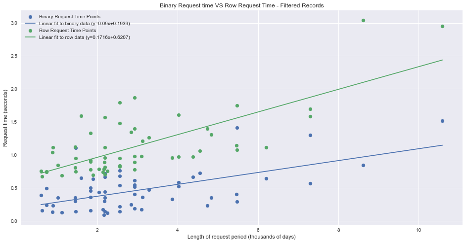
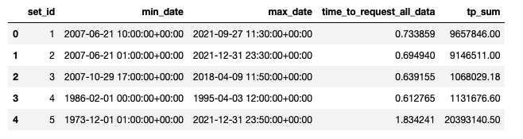
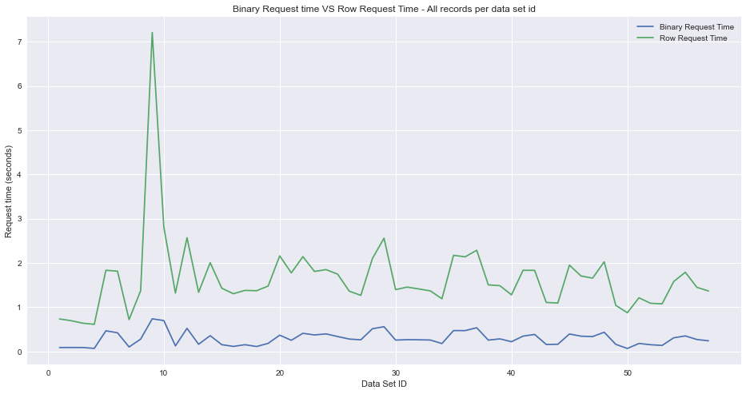
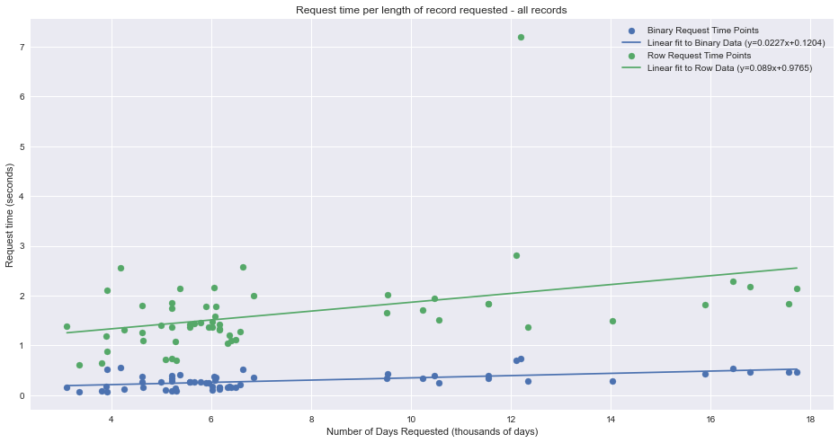
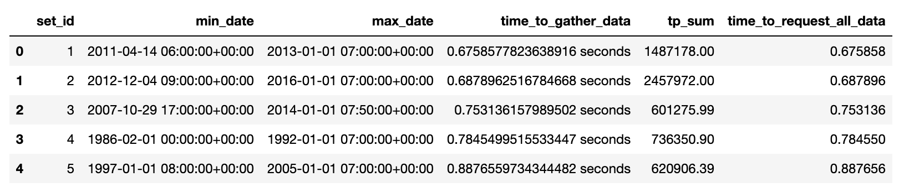
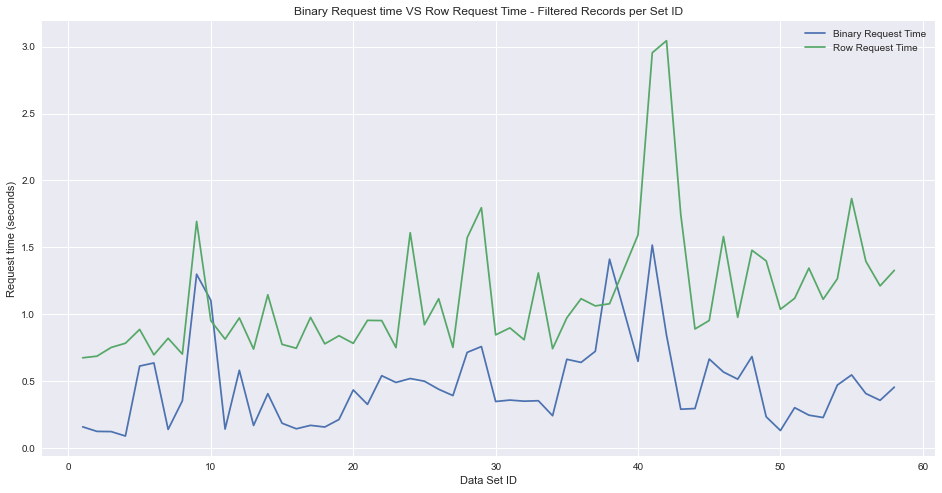
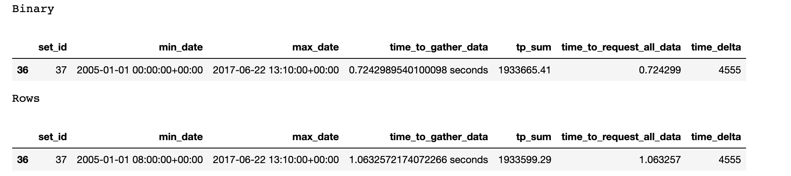

# Time Series Data as Rows vs Binary CSV's <!-- omit in toc -->



# Motivation <!-- omit in toc -->

Time Series data is ever-present in the Industrial Renewable Energy and IoT industries.  Sensor readings tied to the time they were taken, often called `telemetry`, is frequently the data driving the software controlling these systems as well as the decisions being made around them. As these systems grow and continue to operate for longer periods of time, the size of telemetry stored (or the number of records) of course also grows with it.

Here, at Evergreen Innovations, we're frequently working with this telemetry data, so we're often storing lots of these time series data points.  While there are many mediums to store data in these days, we normally defer to a SQL database in order to leverage the relational tools it provides while having a robust persistent data storage option for our control software and monitoring applications.

Further, some applications that work with the time series data from the various sensor types need to frequently access the stored data in order to preform analysis, render it for a user in a web application, or for use in control software decision making.  Due to this need to frequently re-request the data from the database, we became interested in finding out if for some particular use cases if its more efficient to store and query this data as rows stored in the database or as a single row where the data stored is the binary array of the telemetry in csv format.

This blog will cover the process to build a testing environment to explore the efficiency question above and explain the results found in conducting the experiment.

## Data Source <!-- omit in toc -->

In this blog we use an open source python package developed by [SANDIA](https://www.sandia.gov/), [MHKiT](https://github.com/MHKiT-Software/MHKiT-Python), to handle requesting data from [NDBC](https://www.ndbc.noaa.gov/obs.shtml).  NDBC is the National Data Buoy Center, where it provides an enormous source of data from buoys and other sensor types deployed across the oceans of the world.  The buoys from NDBC provide us with the time series telemetry data we're interested in working with. 

## Specifics <!-- omit in toc -->

For the speed tests conduced here, there are a few things to keep in mind:
- The tests we're conducting assume the data stored in database is from many sensors where each can be uniquely identified.  In this blog it's referred to as the **Data Set ID**
- We test for querying the full range of data available - as if we needed to conduct some analysis on all data available.  We also test for querying random ranges of data - as if we needed to render some of the data to a user in a monitoring application.
- Written in python, with Pandas use for working with the csv binary data as well as reading the row data from a local database. Pandas is also used for filtering on the datetime colum for the random range experiment for binary data, filtering is done in the SQL query for the row data.

## Process <!-- omit in toc -->

This blog will cover 3 primary topics:
1. [Database set up and data collection](#database-set-up-and-data-collection)
2. [Querying the database in various ways to collect speed information](#query-database-and-create-result-data)
3. [Analyzing the results and drawing a conclusion](#result-analysis)

## TLDR <!-- omit in toc -->

Querying and filtering the binary data as a csv is faster for the uses cases explored in this blog.

## Database Set Up and Data Collection

### DataBase <!-- omit in toc -->

Our favorite flavor of SQL at EGI is PostgreSQL.  Installing a PostgreSQL server locally is not covered in this blog.

First we create a new database in our local PostgreSQL server, I called it `speed-blog` here. Once we have the new database created, we can go run some queries to set up our tables.  Note, with the `sqlalchemy` package used in the python data insert code, we could create an `ORM` of the table structure we want and use the `sqlalchemy` methods to create the tables and structures needed for this blog.  Regardless of how it's created, here is the underlying sql used:
```sql
-- SQL file to generate the tables needed for this experiment
-- NOTE - if you re-run the insert python code - re-run this file to reset tables
DROP TABLE IF EXISTS row_data;
CREATE TABLE row_data (
    data_set_id int not null,
    date timestamptz not null,
    Hm0 double precision,
    Tp double precision
);

DROP TABLE IF EXISTS binary_data;
CREATE TABLE binary_data(
    data_set_id int not null,
    data bytea not null -- bytea is data type for binary in PostgreSQL
);

DROP TABLE IF EXISTS data_size;
CREATE TABLE data_size (
    data_set_id int,
    data_size_mb double precision
);

SET TIME ZONE 'UTC'; -- help  dates align 
```

The above query will create three tables, `row_data` for the row data we want to store where we have a column for the date of the measurement as well as one column for each piece of telemetry we're storing. Here, since we're working with wave data, we're storing the `Hm0` - significant wave height, and the `Tp` - spectral peak period. The second table created, `binary_data` is the table for storing binary data, where the `data` column is of type `bytea` - the byte array of the csv data we're storing.  And finally, a `data_size` table that was intended for post-analysis, but it turned out to not be all that useful.  

### Data Collection <!-- omit in toc -->

On our [GitHub](https://github.com/evergreen-innovations/blogs/binary-telemetry-storage), all the code related to this blog is available if you're interested in running it locally or taking a closer look at the process. The code that gathers data from the external source and stores it in the database is [here](https://github.com/evergreen-innovations/blogs/binary-telemetry-storage/data_insert.py).


Import needed packages:
```python
# use mhkit to gather some wave data
from mhkit.wave.io import ndbc
from mhkit.wave import resource
# database connection
import sqlalchemy
# io operations
import io
# dataframes
import pandas as pd
```
Define a database connection:

```python

def connect_pg(db_params: dict = None, pool_config: dict = None) -> sqlalchemy.engine.Engine:
    """connects to a postgres database instance

    Args:
        db_params (dict): Dictionary with following keys - any can be left out:
            - DB_USER: str - user to login to db with
            - DB_PASS: str - password for user
            - DB_HOSTNAME: str - localhost or remote host url
            - DB_PORT: int - 5432
            - DB_NAME: str - name of database to connect to
        pool_config (dict): Dictionary with following keys - any can be left out:
            - pool_size: int - max num permanent connections
            - max_overflow: int - temp exceed pool size if no connections available
            - pool_timeout: int - max seconds to wait until when retrieving new connection from pool
            - pool_recycle: int - max seconds a pool connection can persist


    Returns:
        sqlalchemy.engine.Engine: connection pool used in various querying methods
    """
    default_connection = {
        "DB_USER": "postgres",
        "DB_PASS": "postgres",
        "DB_HOSTNAME": "localhost",
        "DB_PORT": 5432,
        "DB_NAME": "speed-blog",
        "drivername": "postgresql",
    }
    params = {}
    if db_params is not None:
        for key in default_connection:
            # use default connection options if missing in db_params arg
            v = db_params.get(key, default_connection[key])
            params[key] = v
    else:
        params = default_connection

    default_pool = {
        "pool_size": 1,
        "max_overflow": 1,
        "pool_timeout": 30,
        "pool_recycle": 3600,
    }

    pool_params = {}
    if pool_config is not None:
        for key in default_pool:
            # use default connection options if missing in pool_config arg
            v = pool_config.get(key, default_pool[key])
            pool_params[key] = v
    else:
        pool_params = default_pool
    # create the connection pool
    pool = sqlalchemy.create_engine(
        sqlalchemy.engine.url.URL(
            drivername=params["drivername"],
            username=params["DB_USER"],
            password=params["DB_PASS"],
            host=params["DB_HOSTNAME"],
            port=params["DB_PORT"],
            database=params["DB_NAME"],
        ),
        **pool_params,
    )

    return pool
```

Above we simply define a function that has default configuration options, but allows a user to pass in custom dictionaries for the database and connection pool returned from the function.  

Next, for this blog I decided we only want to get buoys that have at least 10 years of data available (data is normally at 1 hour intervals from this source), and create a list of the buoys that were found that meet the 10 year criteria:

```python
param = "stdmet"
# gather available data - make a random selection of buoys
available_buoys = ndbc.available_data(parameter=param)

# dataframe has columns of "id", "year", "filename" describing available data in the swden data set form ndbc
available_buoy_ids = available_buoys["id"].unique()
# define our desired minimum span of years
year_span = 10

# array of dataframe sections that meet year span requirement
found = []
for buoy_id in available_buoy_ids:
    # this buoy has bad formatted data throwing errors from MHKiT when parsing the gzip text file requested
    if buoy_id == "41001":
        continue
    d = available_buoys.loc[available_buoys["id"] == buoy_id]
    years = d["year"].unique()
    if len(years) >= year_span:
        found.append(d)
```


Finally, I make the requests to the external data source, using `MHKiT`, organize the data some, make sure time stamps are time zone aware, and keep track of the memory used across the DataFrames collected.  We keep track of the cumulative memory to make it so the collection loop will continue running until we've gathered ~ 0.5 Gb of data:

```python
# want to collect 0.5 gb (500mb) of data
mem_used = 0
mem_desired = 500
# dict of data sets collected
data_sets = {}
# renaming for sql inserts & requried columns
REQUIRED_COLUMNS = set(["WVHT", "DPD"])
RENAME = {"WVHT": "hm0", "DPD": "tp"}

# gather data
for index, df in enumerate(found):
    if mem_used >= mem_desired:
        break
    # long loop - nice to get some progress
    print(df["id"].unique())
    print(mem_used)
    filenames = df["filename"]
    # get dictionary of dataframes per year of available data -> dict keys are the years
    try:
        data_dict = ndbc.request_data(parameter=param, filenames=filenames)
    # handle errors but allow keyboard interrupt to interrupt the loop
    # some data sets aren't formatted correctly and throw errors on parsing the compressed zip file
    except KeyboardInterrupt:
        break
    except:
        continue

    dfs = []
    # format year, month, day, hour, minute columns, and unpack the dict of {year : pd.DataFrame}
    for year in data_dict:
        data_dict[year] = ndbc.to_datetime_index(parameter=param, ndbc_data=data_dict[year])
        dfs.append(data_dict[year])
    try:
        # some data sources may not return proper columns
        data = pd.concat(dfs)
    except KeyboardInterrupt:
        break
    except:
        continue

    try:
        # remove unit row
        data = data[data["WVHT"] != "m"]
        # only columns we want
        data = data[list(REQUIRED_COLUMNS)]
        # float
        data[list(REQUIRED_COLUMNS)] = data[list(REQUIRED_COLUMNS)].astype(float)
        # sort df
        data = data.sort_index()
        # rename columns
        data = data.rename(columns=RENAME)
    except KeyboardInterrupt:
        break
    except:
        continue

    data[["hm0", "tp"]] = data[["hm0", "tp"]].astype(float)  # make sure data is numeric
    data["date"] = data.index
    data = data.reset_index(drop=True)
    data["data_set_id"] = index + 1
    data["date"] = pd.to_datetime(data["date"], utc=True)
    data_sets[index + 1] = {}
    data_sets[index + 1]["data"] = data
    data_sets[index + 1]["data_size"] = data.memory_usage(deep=True).sum() / 1e6
    mem_used += data.memory_usage(deep=True).sum() / 1e6
```
Finally, we go through and insert all the data into our local database.  One thing that is always good to do with python database connections is to use the `with` keyword to have a context manager be sure to automatically close the connection created, this same practice should be used for opening and closing files too.

```python

# binary insert query - sqlalchemy bindvars
q_insert = """
    INSERT into binary_data (data_set_id, data)
    VALUES
    (:data_set_id, :data)
"""
# size insert
q_size = """
    INSERT INTO data_size (data_set_id, data_size_mb)
    VALUES
    (:data_set_id, :data_size_mb)
"""

# No args as EGI setup works with default options
pool = connect_pg()


# context manager to close the pool connection
with pool.connect() as c:
    for key in data_sets:
        # display info on each insert
        print(data_sets[key]["data"].head())
        print("Above table using {} MB".format(data_sets[key]["data_size"]))
        data = data_sets[key]["data"]
        # insert the row data
        data.to_sql(name="row_data", con=c, if_exists="append", index=False)
        # remove data_set_id from df - only storing the csv data in bytes
        # still have the same data_set_id, but its not in the csv/ dataframe here
        data = data.drop(columns=["data_set_id"])
        # prepare bytes
        buf = io.StringIO()
        data.to_csv(buf)
        # reset buffer to start point
        buf.seek(0)
        rs = c.execute(
            sqlalchemy.text(q_insert),
            {
                "data_set_id": key,
                "data": buf.read(),  # reason we needed to seek to 0 point
            },
        )
        # insert size - easier for post analysis to re-grab the size
        rs = c.execute(
            sqlalchemy.text(q_size),
            {"data_set_id": key, "data_size_mb": data_sets[key]["data_size"]},
        )
```

This above routine is a bit slow, so if you're going to be running it for testing locally, be ready to wait for a bit as the data is extracted, transformed, and loaded (ETL) into the local database. 

## Query Database and Create Result Data

Now that we've stored all the data needed, we can really dig into the experiment.  Will it be faster to query the data from the database as a csv in binary, read that into a DataFrame and work with it, or query the rows from the database, read that into a DataFrame and work with it from there?  Again, keep in mind that we have two use cases, querying all the data for analysis, and querying subsets of the data for rendering in a user application.

The full python code can be found [here](https://github.com/evergreen-innovations/blogs/binary-telemetry-storage/data_retrieval.py).

Imports:
```python
# db connection
import sqlalchemy
# io operations
import io
# dataframes
import pandas as pd
# time operations (simple method)
import time
# random operations
import random
```

We use the exact same database connection and pool code as above, the `connect_pg()` function.

First we create some query templates, generate a list of the available `data_set_id` values in the database, and run a query to get the range of data stored for each available `data_set_id` we stored in the database.  This available range of data is used in the last loop in the following section to create a random start and end year within the available range of dates for each `data_set_id` we've stored.  We then use this random range in the speed tests related to filtering the data returned. Note - the `data_set_id's` align across the two tables because we inserted it for each based off the index a loop while inserting the data.

```python

data_log_rows = {
    "set_id": [],
    "min_date": [],
    "max_date": [],
    "time_to_request_all_data": [],
    "tp_sum": [],
}

data_log_binary = {
    "set_id": [],
    "min_date": [],
    "max_date": [],
    "time_to_request_all_data": [],
    "tp_sum": [],
}

# 58 data sets
availabe_ids = list(range(1, 58))
row_q = """
SELECT * FROM row_data where data_set_id = {}
"""
binary_q = """
SELECT * from binary_data where data_set_id = (:set_id)
"""
# no options needed for EGI connection parameters
pool = connect_pg()

req_query = """
SELECT data_set_id, min(date), max(date)
from row_data
group by data_set_id;
"""

with pool.connect() as c:
    req_info = pd.read_sql(sql=req_query, con=c)

requests = []

# build request parameters for filtering the data
for d in req_info.iterrows():
    start = pd.to_datetime(d[1]["min"]).year
    end = pd.to_datetime(d[1]["max"]).year
    # sample two numbers between start and end years for random duration to filter down to in testing
    years = random.sample(range(start, end), 2)
    requests.append({"id": d[1]["data_set_id"], "start_year": min(years), "end_year": max(years)})
```

Now that we've built our query parameters and database connection, lets start with requesting all of the data available and storing the speed of the request, the date range requested, and the sum of the Tp values as a check that we've in fact gathered the same data between the row and binary data stored.  We'll collect that information and store it in two csv's: `all_years_rows.csv` and `all_years_binary.csv`.

```python
# gather all data - no filtering - for analysis
with pool.connect() as c:
    for id in availabe_ids:
        print(f"Getting all data for data_id {id}")
        # row data
        start = time.time()
        d_rows = pd.read_sql(sql=row_q.format(id), con=c)
        data_log_rows["set_id"].append(d_rows["data_set_id"].unique())
        end = time.time() - start
        data_log_rows["time_to_request_all_data"].append(f"{end} seconds")
        d_rows["date"] = pd.to_datetime(d_rows["date"], utc=True)
        min_date = d_rows.date.min()
        max_date = d_rows.date.max()
        tp_sum = d_rows["tp"].sum()
        data_log_rows["tp_sum"].append(tp_sum)
        data_log_rows["max_date"].append(max_date)
        data_log_rows["min_date"].append(min_date)

        # binary data
        start = time.time()
        rs = c.execute(sqlalchemy.text(binary_q), {"set_id": id})
        res = rs.fetchall()
        d = io.BytesIO(res[0]["data"]) 
        d_binary = pd.read_csv(d)
        end = time.time() - start
        data_log_binary["time_to_request_all_data"].append(f"{end} seconds")
        d_binary["date"] = pd.to_datetime(d_binary["date"], utc=True)
        min_date = d_binary.date.min()
        max_date = d_binary.date.max()
        data_log_binary["max_date"].append(max_date)
        data_log_binary["min_date"].append(min_date)
        data_log_binary["tp_sum"].append(d_binary["tp"].sum())

        d_id = res[0]["data_set_id"]  # one row per data set so okay to index this way
        data_log_binary["set_id"].append(d_id)


data_log_binary = pd.DataFrame(data_log_binary)
data_log_rows = pd.DataFrame(data_log_rows)
# store results
data_log_rows.to_csv("all_years_rows.csv", index=False)
data_log_binary.to_csv("all_years_binary.csv", index=False)

```

Finally, we'll do the same request and storing process as above, but we'll use the random date ranges generated at the start of this section to filter the row data and binary data down to the selected time period. 

```python
# new query for fow data - binary still the same
row_q = """
SELECT * from row_data WHERE data_set_id = {id}
and extract(YEAR from date) >= {start_year}
and extract(YEAR from date) <= {end_year}
"""

# do same as above but with filtering in the time frame - request one year at a time
data_log_rows = {
    "set_id": [],
    "min_date": [],
    "max_date": [],
    "time_to_gather_data": [],
    "tp_sum": [],
}

data_log_binary = {
    "set_id": [],
    "min_date": [],
    "max_date": [],
    "time_to_gather_data": [],
    "tp_sum": [],
}

with pool.connect() as c:
    for param in requests:
        print(f"Getting data with params {param}")
        # row data
        start = time.time()
        # can unpack the param dictionary based off the format var names in query
        d_rows = pd.read_sql(sql=row_q.format(**param), con=c)
        data_log_rows["set_id"].append(d_rows["data_set_id"].unique())
        end = time.time() - start
        data_log_rows["time_to_gather_data"].append(f"{end} seconds")
        d_rows["date"] = pd.to_datetime(d_rows["date"], utc=True)
        min_date = d_rows.date.min()
        max_date = d_rows.date.max()
        tp_sum = d_rows["tp"].sum()
        data_log_rows["tp_sum"].append(tp_sum)
        data_log_rows["max_date"].append(max_date)
        data_log_rows["min_date"].append(min_date)

        # binary data
        start = time.time()
        rs = c.execute(sqlalchemy.text(binary_q), {"set_id": param["id"]})
        res = rs.fetchall()
        d = io.BytesIO(res[0]["data"])  # binary data
        d_binary = pd.read_csv(d)
        d_binary["date"] = pd.to_datetime(d_binary["date"], utc=True)
        # need to filter dataframe in memory here
        mask = (d_binary["date"].dt.year >= param["start_year"]) & (
            d_binary["date"].dt.year <= param["end_year"]
        )
        d_binary = d_binary[mask]
        end = time.time() - start
        data_log_binary["time_to_gather_data"].append(f"{end} seconds")

        min_date = d_binary.date.min()
        max_date = d_binary.date.max()
        data_log_binary["max_date"].append(max_date)
        data_log_binary["min_date"].append(min_date)
        data_log_binary["tp_sum"].append(d_binary["tp"].sum())

        d_id = res[0]["data_set_id"]  # one row per data set so okay to index this way
        data_log_binary["set_id"].append(d_id)


data_log_binary = pd.DataFrame(data_log_binary)
data_log_rows = pd.DataFrame(data_log_rows)
# store data
data_log_rows.to_csv("filtered_years_rows.csv", index=False)
data_log_binary.to_csv("filtered_years_binary.csv", index=False)
```
# Result Analysis

The full analysis notebook can be found [here](https://github.com/evergreen-innovations/blogs/binary-telemetry-storage/Results-Analysis.ipynb).


Imports and a few constants:
```python
import pandas as pd
import matplotlib.pyplot as plt

from sklearn.linear_model import LinearRegression


plt.style.use('seaborn')

binary = {
    "all":"all_years_binary.csv",
    "filtered":"filtered_years_binary.csv"
}

rows = {
    "all":"all_years_rows.csv",
    "filtered":"filtered_years_rows.csv"
}
```

Load data and view (do the same for both DataFrames): 

```python
all_rows = pd.read_csv(rows["all"])
# some transform based off how result data was stored in the csvs
all_rows["set_id"] = all_rows["set_id"].map(lambda x : int(x.strip("[").strip("]")))
all_rows["time_to_request_all_data"] = all_rows["time_to_request_all_data"].map(lambda x: str(x).split(' ')[0]).astype(float)
all_rows.head()
```
Jupyter Notebook output:



Plot the two Data Sets, looking at the difference in request time per data set requested.

```python
plt.figure(figsize=(16,8))
plt.plot(all_binary["set_id"], all_binary["time_to_request_all_data"], label="Binary Request Time")
plt.plot(all_rows["set_id"], all_rows["time_to_request_all_data"], label="Row Request Time")
plt.legend()
plt.title("Binary Request time VS Row Request Time - All records per data set id")
plt.xlabel("Data Set ID")
plt.ylabel("Request time (seconds)")

plt.savefig("all_records_per_id.png")
plt.show()
```


First results seem to show that requesting all data points is slightly faster per request when using the binary data method over the row data method.  What could cause this?  When the database is filtering down to gather this data, it used a query that has a `where` clause on the `data_set_id`, where this ID is not unique because there could potentially be hundreds of thousands of rows with that `data_set_id` when it's hourly data for a long time period.  So the database has to loop through the records and grab rows that have that `data_set_id`.

With this in mind, lets look at the data where we're comparing the request time with the length of the data requested.  Out of interest, here I've added in a quick linear regression to look at the very general trend in the relationship between length of data requested and time it took to request and unpack it into a DataFrame:

```python 
all_binary["min_date"] = pd.to_datetime(all_binary["min_date"])
all_binary["max_date"] = pd.to_datetime(all_binary["max_date"])
all_binary["time_delta"] = (all_binary["max_date"] - all_binary["min_date"]).dt.days / 1000


all_rows["min_date"] = pd.to_datetime(all_rows["min_date"])
all_rows["max_date"] = pd.to_datetime(all_rows["max_date"])
all_rows["time_delta"] = (all_rows["max_date"] - all_rows["min_date"]).dt.days / 1000

all_binary = all_binary.sort_values(by="time_delta")
all_rows = all_rows.sort_values(by="time_delta")

# regression
x_b = all_binary["time_delta"].values.reshape(-1,1)
y_b = all_binary["time_to_request_all_data"].values.reshape(-1,1)

r = LinearRegression()
r.fit(x_b, y_b)
y_pred_b = r.predict(x_b)


x_r = all_rows["time_delta"].values.reshape(-1,1)
y_r = all_rows["time_to_request_all_data"].values.reshape(-1,1)

r_row = LinearRegression()
r_row.fit(x_r, y_r)
y_pred_r = r_row.predict(x_r)

plt.figure(figsize=(16,8))
plt.scatter(all_binary["time_delta"], all_binary["time_to_request_all_data"], label="Binary Request Time Points")
plt.plot(all_binary["time_delta"], y_pred_b, label="Linear fit to Binary Data (y={}x+{})".format(round(r.coef_[0][0],4), round(r.intercept_[0], 4)))
plt.scatter(all_rows["time_delta"], all_rows["time_to_request_all_data"], label="Row Request Time Points")
plt.plot(all_rows["time_delta"], y_pred_r, label="Linear fit to Row Data (y={}x+{})".format(round(r_row.coef_[0][0], 4), round(r_row.intercept_[0], 4)))
plt.legend()
plt.title("Request time per length of record requested - all records")
plt.xlabel("Number of Days Requested (thousands of days)")
plt.ylabel("Request time (seconds)")

plt.savefig("all_records_per_length.png")
plt.show()
```


This plot seems to confirm the interpretation above, it seems as though the time it takes to request the data is closely related with the number of records being requested (looping lots of `data_set_id` values).  The legend shows that the slope of the binary data is `0.023` while the slope of the row data is `0.089`.  The independent variable here is the length of data returned (in thousands of days to scale the slope) and the dependent is the time of the request. So in other words, the slopes of the fits can be interpreted as essentially saying that the row data's increase in request time is **more** effected proportionally by the increase in the time period of data requested, meaning the time to query the data becomes longer more quickly while increasing the number of days requested. Finally, the intercept values indicate that the baseline speed for requests in these tables is faster in the binary tables, this is likely due to having significantly less rows in general.  Binary data has one row per data set while row data has potentially hundreds of thousands.

So binary seems to be faster for all data, lets look at when we're filtering the rows (same for both DataFrames):

```python 
f_rows = pd.read_csv(rows["filtered"])
# one row is null in filtering
f_rows = f_rows.dropna()
f_rows["set_id"] = f_rows["set_id"].map(lambda x : int(x.strip("[").strip("]")))
f_rows["time_to_request_all_data"] = f_rows["time_to_gather_data"].map(lambda x: str(x).split(' ')[0]).astype(float)
f_rows.head()
```



Plot:
```python 
plt.figure(figsize=(16,8))
plt.plot(f_bin["set_id"], f_bin["time_to_request_all_data"], label="Binary Request Time")
plt.plot(f_rows["set_id"], f_rows["time_to_request_all_data"], label="Row Request Time")
plt.legend()
plt.title("Binary Request time VS Row Request Time - Filtered Records per Set ID")
plt.xlabel("Data Set ID")
plt.ylabel("Request time (seconds)")
plt.savefig("filtered_records_per_id.png")
plt.show()
```



So this plot is about the same as above, it generally appears as though the binary data is also quicker to request even when the filtering is then done in pandas on the dates rather than in sql on the date column. This is again likely due to reducing the overall number of loops performed because the binary data query only has one `data_set_id` per data set (one row).

There is one point where the sql response was faster though! Lets look the raw data for that point:
```python
print("Binary")
display(f_bin.loc[f_bin["set_id"] == 37,:])
print("Rows")
display(f_rows.loc[f_rows["set_id"] == 37,:])
```



That's a bit odd, why don't the TP values align? It appears as though some of the timestamp information returned from the buoys wasn't successfully converted to UTC when inserting into the database.  Meaning, the timestamp itself was set to the proper `+00:00` offset, but the needed addition/ subtraction to the hours in the timestamp didn't occur.  So basically all this means is there is around 8 hrs of missing data between the two results depending on the timezone that the given buoy was reporting in. Fortunately, due the magnitude of these data sets (at a minimum 10 years), the 8 hrs of records being missed by the filtering doesn't effect the results of this experiment.

Finally, lets look at the difference in speed when considering the length of the data requested (in thousands of days):

```python
f_bin["min_date"] = pd.to_datetime(f_bin["min_date"])
f_bin["max_date"] = pd.to_datetime(f_bin["max_date"])
f_bin["time_delta"] = (f_bin["max_date"] - f_bin["min_date"]).dt.days / 1000


f_rows["min_date"] = pd.to_datetime(f_rows["min_date"])
f_rows["max_date"] = pd.to_datetime(f_rows["max_date"])
f_rows["time_delta"] = (f_rows["max_date"] - f_rows["min_date"]).dt.days / 1000

f_bin = f_bin.sort_values(by="time_delta")
f_rows = f_rows.sort_values(by="time_delta")

# regression
x_b = f_bin["time_delta"].values.reshape(-1,1)
y_b = f_bin["time_to_request_all_data"].values.reshape(-1,1)

r_bin = LinearRegression()
r_bin.fit(x_b, y_b)
y_pred_b = r_bin.predict(x_b)

x_r = f_rows["time_delta"].values.reshape(-1,1)
y_r = f_rows["time_to_request_all_data"].values.reshape(-1,1)

r_row = LinearRegression()
r_row.fit(x_r, y_r)
y_pred_r = r_row.predict(x_r)

plt.figure(figsize=(16,8))
plt.scatter(f_bin["time_delta"], f_bin["time_to_request_all_data"], label="Binary Request Time Points")
plt.plot(f_bin["time_delta"], y_pred_b, label="Linear fit to binary data (y={}x+{})".format(round(r_bin.coef_[0][0], 4), round(r_bin.intercept_[0], 4)))
plt.scatter(f_rows["time_delta"], f_rows["time_to_request_all_data"], label="Row Request Time Points")
plt.plot(f_rows["time_delta"], y_pred_r, label="Linear fit to row data (y={}x+{})".format(round(r_row.coef_[0][0], 4), round(r_row.intercept_[0], 4)))
plt.legend()
plt.title("Binary Request time VS Row Request Time - Filtered Records")
plt.xlabel("Length of request period (thousands of days)")
plt.ylabel("Request time (seconds)")
plt.savefig("filtered_records_per_length.png")
plt.show()
```


Looking at the slopes again (`.09` for binary, `.17` for rows), there is a similar story shown here with the time to work with the binary data being faster.  Interestingly the ratio between the two (binary slope / row slope) is now `0.53`, while the same ratio in the non-filtered results was `0.26`, meaning we're now only decreasing the request time by about 50% rather than about 75% when filtering the data returned based off date ranges.  This difference seems to indicate that the date filtering is in fact faster on a 1-to-1 basis in sql than using the masked array on the timestamp column on the DataFrames that are returned.   However, since our experiment isn't only to do with filtering on date columns, but also with having many different uniquely identifiable data sets within one table of time series telemetry, the results are still valid.


## Conclusion <!-- omit in toc -->


So what can we make of all this? With the simple analysis results in hand, it seems safe to say that for these particular use cases, storing the data as a binary array of the csv data, where each data set would only have one row is the faster option.

While we can draw this conclusion, it's important to point out some known limitations of this experiment:

1. Timing methods are inexact, this was all ran on an EGI developer's Mac, where background processes and tasks could effect the timing.  
2. We're using Pandas a lot for this experiment.  Both retrieval methods use pandas to read in the data into a DataFrame object, cast the datetime column to a python datetime object, then filter if working with binary data based off a masked array on the datetime column. Pandas is known to be very useful for analysts, its also not known for being highly optimized for speedy operations.  For example, using sqlAlchemy directly for querying the binary data was needed to handle the byte array response from the DB, and we use `pd.read_sql()` to read in the row data.  Both methods end up where pandas is handling the data, but there is a chance the `read_sql()` function (using sqlAlchemy under the hood) introduces some computational expense that slows things down.
3. Only ~60 data sets used, and ~60 query responses timed for both non-filtered and date-filtered time tests.  Running the experiment for longer would help identify if some of the data points that appear as outliers are truly outliers or part of the trend.
4. Linear Regression isn't the best analysis technique here, it's simply a quick way to see a very general trend in the relationship between dependent and independent variables.  While the coefficient for the dependent variable (slope) was pointed out, this fit hasn't been optimized so it wouldn't be safe to extrapolate out to larger data size requests, but rather a numeric metric to put on the data to help make comparison better than just "eyeballing it".
5. Indexing could be done on the `data_set_id` column, particularly on the row data table to help with speed. Currently, the lookups for filtering down to the rows with the proper `data_set_id` is being handled by a sequential scan on the int column.  Indexing is generally faster than sequential scans, but also increases overall storage size (to store the index itself).  This was left out because normally there are joins to other tables that would be included in these requests (say letting us know information about the buoy with each record), where joining records potentially millions of times would essentially remove the index speed benefit (yes, there are more complicated structure approaches to help handle this).  With the binary data, since it's one row, the joins to other tables would also be faster, so building all this into the experiment didn't seem helpful.


