# Continuous Delivery

## Motivation

Continuous delivery (CD) refers to a process that automates software deployment from a code repository. As more teams are adopting agile software development methodologies, the code changes more frequently. Following continuous delivery practices allows the software developers to focus on application development, code testing, and security, since the deployment is automated. Additionally, the code can be improved continuously; it can be deployed reliably, with scheduled and minimal downtime.

This post introduces Github actions, explains some of the common terminology, and shows automated deployment for three mock microservices from a Github code repository to an AWS EC2 server.

## GitHub Actions

GitHub Actions is a continuous delivery product introduced by GitHub in 2019. GitHub Actions integrates seamlessly with Github. In its free tier, GitHub offers 2000 action minutes/month, which is sufficient for small to medium code bases.

## GitHub terminology

GitHub Actions allows the developer to create ```workflows``` to automatically test, build, release and deploy code. YAML files are used to define workflows and configurations. You can learn more about YAML [here](https://yaml.org/).

A workflow is an automated procedure that you can add to your repository. Workflows are made up of one or more ```jobs```. These can be scheduled, triggered by an event, or executed manually. Each job has individual tasks that are executed as part of the job, referred to as ```steps```.

Another component in a workflow is a ```runner```. A ```runner``` is a virtual machine hosted by Github on which the jobs are run. One can use GitHub hosted or self-hosted runners. You can learn more about GitHub Actions [here](https://docs.github.com/en/free-pro-team@latest/actions).


## Mock microservices
We will use GitHub Actions to deploy three microservices to an [EC2](https://aws.amazon.com/ec2/?ec2-whats-new.sort-by=item.additionalFields.postDateTime&ec2-whats-new.sort-order=desc) instance. We have three mock microservices written in Go - serviceA, serverB and serverC. These three microservices communicate using HTTP REST API. In this example:

* ServiceA sends a random value between 0-10 to ```http://localhost:9000/post```

* ServiceB hosts the POST endpoint at - ```http://localhost:9000/post```. Our example serverB, on receiving a value from serviceA, adds a 100 and sends to it serviceC.

* ServiceC has two endpoints.
  * GET endpoint ```http://localhost:15000/get``` to display all the values sent.
  * POST endpoint ```http://localhost:15000/post``` to display receive the values sent. After receiving the values, serverC adds another 100 and finally adds it to the global variable.

This code can be found at the EGI Github repository [here](https://github.com/evergreen-innovations/blogs/tree/master/cd-S3). 

## AWS Configuration

In AWS, we need to set up three services. The steps can be automated using CloudFormation templates but this blog will explain the steps using the AWS console.

1. EC2 -  to deploy the code.
1. CodeDeploy - deployment service that facilitates easy deployment on AWS instances.
1. IAM Role - manage CodeDeploy permissions to access the EC2 server

### EC2

Let's set up the EC2 instance. 

* Under services, select EC2. If you already have an instance running, select the instance you want to use. If you still don't have a server up and running, ```Launch a new EC2 instance```. 

You can read about how to do that [here](https://docs.aws.amazon.com/quickstarts/latest/vmlaunch/step-1-launch-instance.html).

While configuring security groups, allow port 22 and 15000 access from at least your IP address.

* Now select your instance, click on the ```Tags``` tab. Click on ```Manage tags```. Assign it a meaningful tag. CodeDeploy uses this tag to find the instance.

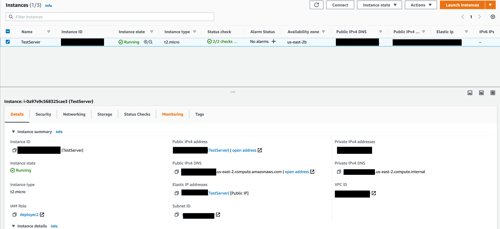

* SSH into the EC2 server (see guide [here](https://docs.aws.amazon.com/AWSEC2/latest/UserGuide/AccessingInstances.html))

* Install the code deployer agent on the EC2 server (see guide [here](https://docs.aws.amazon.com/codedeploy/latest/userguide/codedeploy-agent-operations-install-ubuntu.html)) for a Ubuntu server.

### IAM Role
The next step is to create an IAM role. We will need a role, which is assigned to CodeDeploy, with permission to access the EC2 instance

* Under services, select ```IAM``` next. We will create a role with permissions to access EC2. Click on ```Roles -> Create Role```

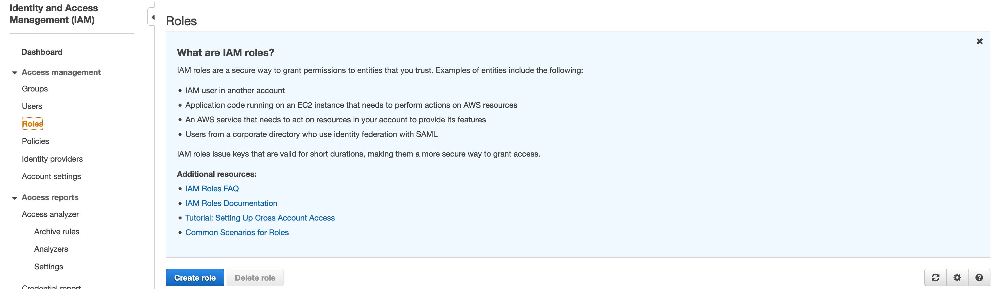

* Select the service ```CodeDeploy```. Click on ```Next:Permissions```.

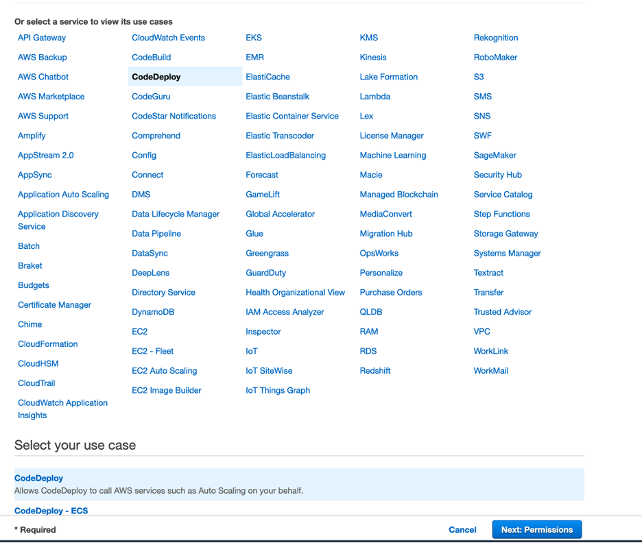

* The role should have the following policies attached. These are rather broad and could be made more specific. 

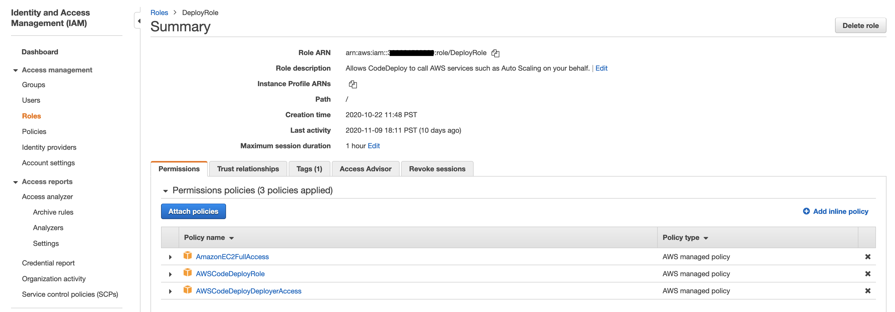

**Note:** See [here](https://docs.aws.amazon.com/codedeploy/latest/userguide/getting-started-create-service-role.html) for additional info. To find out more about roles, why and how they are used, see [here](https://docs.aws.amazon.com/IAM/latest/UserGuide/id_roles.html)

### CodeDeploy Settings
AWS CodeDeploy automates your software deployments, allowing for reliable and rapid deployment. CodeDeploy can be used to deploy the application to Amazon EC2, AWS Fargate, AWS Lambda, or your on-premises servers. 

There is no additional charge for using CodeDeploy to deploy on AWS services - EC2, Lambda, Fargate. There is an additional charge when CodeDeploy is used to deploy the application on an on-premise server.

* Once you sign in to AWS, start by selecting CodeDeploy under ```Services```.

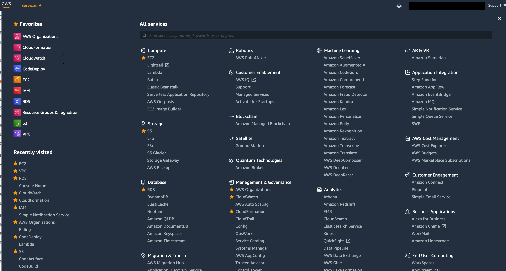

* Under CodeDeploy, Select ```Applications``` -> ```Create Application```.

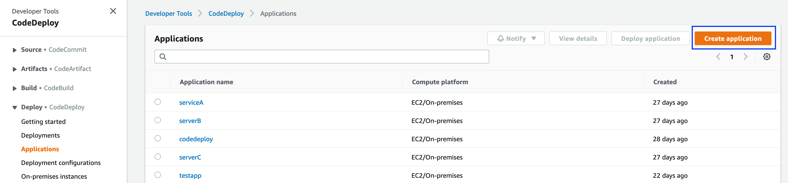

* Enter the Application Name and select compute platform drop-down. This will be EC2/On-premise.

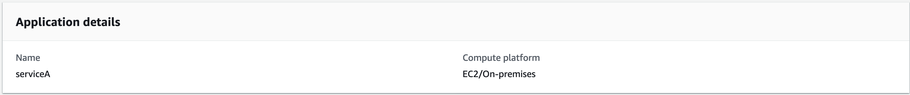

* Once you create an Application. From the Applications dashboard, click on the Application and select ```Create Deployment Group```.

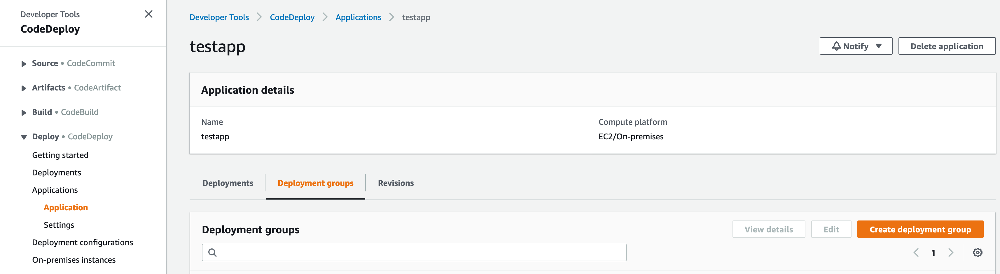


* For ```Create Deployment Group```, enter the information in the form. An example is shown below,


The tag used is specified by us in the EC2 section.

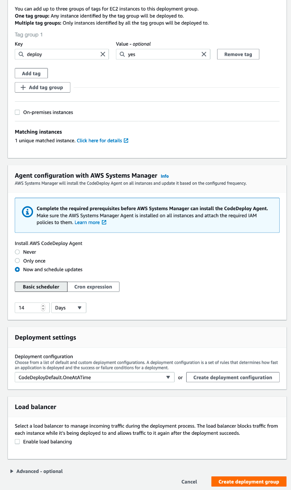

### S3

* Create a AWS S3 bucket

## GitHub

Copy the services A,B and C in this repository as three repositories.

* Add the AWS user credentials with permissions to access CodeDeploy to Github Secrets. To add secrets, click on the repository, ```Settings``` tab -> ```Secrets```.
    
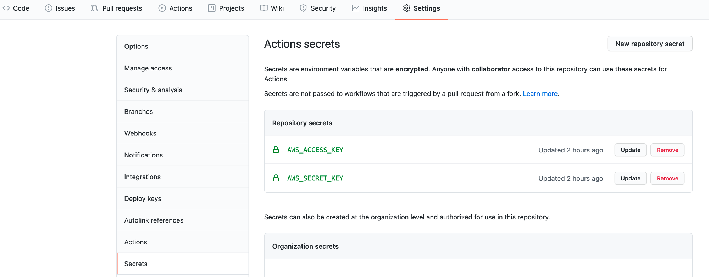

* CodeDeploy deploys the application in 7 different stages. At each stage you need to provide it with a script to run. For our mock services these sit under the ```scripts/ ``` folder. The ```appspec.yml``` file is needed to specify the location of the scripts. This file also mentions the source and the destination of the executable. For this example, ApplicationStart.sh has the following information:
```shell
#!/bin/bash
/opt/servicec > /dev/null 2> /dev/null < /dev/null &
```
In this example, the executables are placed in the ```/opt``` directory of the EC2 instance.

```shell
files:
  - source: /app1
    destination: /opt
```
Your GitHub workflow is all setup now to access and deploy applications using CodeDeploy. Repeat the steps for the other two services.

## Actions 

The workflow ```.yml``` files should be placed under the ```.github/workflows``` folder in the code directory. We use three workflows in this example, ```testing.yml```, ```release.yml``` and ```deploy.yml```. 

The ```tests.yml``` workflow runs unit tests on the go code. This workflow is triggered when code is pushed on the ```dev``` branch with the tag ```test-*```.

Job in the workflow include the following steps:

1. Checkout the code from dev (configured as default) branch.
1. Run unit tests defined in ```module_test.go ``` file using ```go test```.

 ```yaml
  # This GitHub Actions workflow gets trigger on a push event on develop branch with a version tag
  name: RunTests
  on:
    push:
      tags:
          - 'test-*' # Push events to matching v*, i.e. v1.0, v20.15.10
  jobs:
    test:
      strategy:
        matrix:
          go-version: [1.15.x]
          platform: [ubuntu-latest, ubuntu-18.04]
      runs-on: ${{ matrix.platform }}
      steps:
        - name: Install Go
          if: success()
          uses: actions/setup-go@v2
          with:
              go-version: ${{ matrix.go-version }}

        - name: Checkout code
          uses: actions/checkout@v2

        - name: Run tests in tests
          ## Change directory as applicable
          run: go test -v -covermode=count
  ```

The ```release.yml``` workflow creates a code release on GitHub. It also create a executable of the code in the repository, and uploads the files needed on to the S3 bucket.

This workflow is triggered manually with user inputs.

```yaml
# Name of the workflow/action
name: Build&Release
on:
  workflow_dispatch:
    inputs:
      releaseVersion:
        description: 'Version tag'     
        required: true
      releaseBody:
        description: 'Release changes'     
        required: true
      branchName:
        description: 'Branch name'     
        required: true
        default: develop
      buildZipName:
        description: 'Build zip file name'     
        required: true
        default: <replace with filename makefile>.zip
      # Name of the s3 bucket created in AWS
      s3Bucket:
        description: 'S3 bucket name'     
        required: true
        default: <replace with default bucket name>
```

The release job in the workflow include the following steps:

1. Checkout the code from main branch
1. Get the Go dependencies using ```go get```
1. Create the Go release.

```yaml
  # job name
  release:
    name: Release on GitHub
    runs-on: ubuntu-18.04
    steps:
      - name: Check out code
        uses: actions/checkout@v1
        with:
          ref: ${{ github.event.inputs.branchName }}
    
      - name: Validates GO releaser config
        uses: docker://goreleaser/goreleaser:latest
        with:
          args: check

      - name: Create Release
        id: create_release
        uses: actions/create-release@v1
        env:
          GITHUB_TOKEN: ${{ secrets.GITHUB_TOKEN }} # This token is provided by Actions
        with:
          tag_name: ${{ github.event.inputs.releaseVersion }}
          release_name: Release ${{ github.event.inputs.releaseVersion }}
          body: |
            ${{ github.event.inputs.releaseBody }}
          draft: false
          prerelease: false
```

The build job in the workflow include the following steps:

1. Checkout the code from the main branch (same as before)
2. Get dependencies
3. Set up the go version
4. Configure AWS credentials
5. Run the make command
6. Push the created zip file to AWS S3.
``` yaml
   build:
    name: Build and upload on s3
    runs-on: ubuntu-latest
    steps:
      - name: Check out code
        uses: actions/checkout@v1
        with:
          ref: ${{ github.event.inputs.branchName }}
      
      - name: Get dependencies
        run: |
            go get -v -t -d ./...
            if [ -f Gopkg.toml ]; then
                curl https://raw.githubusercontent.com/golang/dep/master/install.sh | sh
                dep ensure
            fi

      - name: Set up Go 1.15
        uses: actions/setup-go@v2
        with:
          go-version: 1.15.x
        id: go
        
      - name: Create local changes
        run: |
          make build

      - name: Configure AWS credentials
        uses: aws-actions/configure-aws-credentials@v1
        with:
          aws-access-key-id: ${{ secrets.AWS_ACCESS_KEY }}
          aws-secret-access-key: ${{ secrets.AWS_SECRET_KEY }}
          aws-region: us-east-2

      - name: Upload to S3
        run: |
              aws s3 cp ${{ github.event.inputs.buildZipName }} s3://${{ github.event.inputs.s3Bucket }}/
```
## Workflow in action 

To test the above, we trigger the dev branch manually. Click on the Actions tab to check the jobs running and the workflow status. 

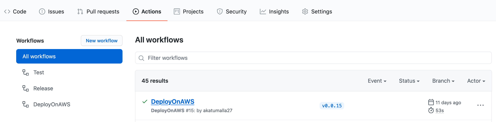

Let's take a look at ```DeployOnAWS``` workflow. It has one job called ```Deploy```, and steps for each job are on the right.
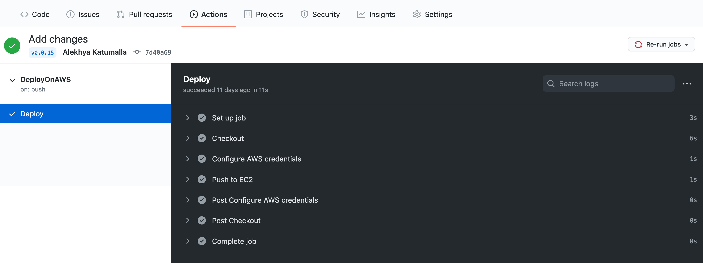

One can look at the output of each step. For instance, let's look at the output for ```Test``` workflow below,
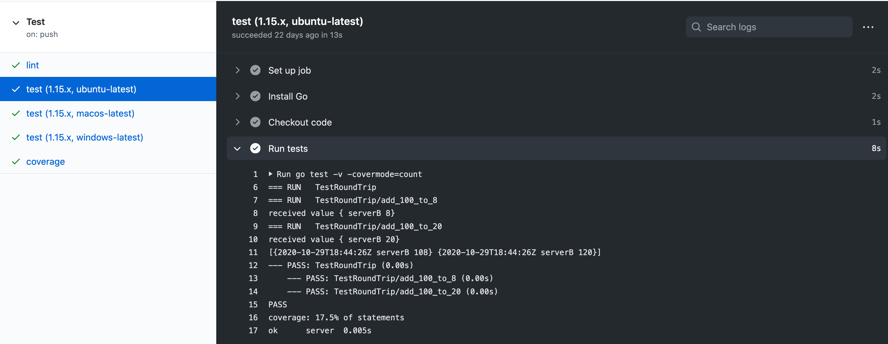


## Test the Mock Services

The mock services are now ready to be tested. 

* SSH into the EC2 server (see [here](https://docs.aws.amazon.com/AWSEC2/latest/UserGuide/AccessingInstancesLinux.html).)

* Navigate to the ```/opt``` folder. Your executables should be located here.


A summary of the executable for the mock services:

```
app1 (serverC) 
app2 (serverB)
app3 (serviceA)
```

* Run app3. 

```shell
./app3
```

* Navigate to a HTTP client, such as Postman. Perform a ```/get``` on serverC. 

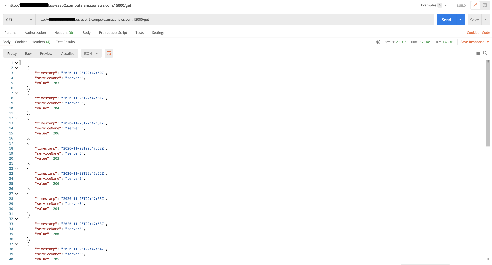

An example /get for the EC2 server we have running is shown below. The link will change based on the IP address or the domain name of the server.
``` shell
http://<public dns of ec2 instance>:15000/get
```

If you cannot reach the server, check that you have added a rule to allow TCP traffic on port 15000 in the security groups.

## GitHub Actions vs. Jenkins
One of most common questions we are asked are the benefits of using GitHub action over Jenkins. Jenkins is a widely used continuous delivery application. Although Jenkins has been used in the industry for over ten years, it adds substantial costs. It adds cost of not only self-hosting and maintaining the Jenkins server, but also developer time. For many use cases, GitHub Actions can fulfill the criteria and perform all actions in a similar fashion as Jenkins, such as parallel jobs and container-based builds, but with less overhead when compared to Jenkins. If more custom actions are needed, Jenkins files can be run inside a GitHub actions Docker container.

## Conclusion
This blog explained the steps involved in deploying applications on EC2 servers using GitHub Actions. Please contact us if you have any questions about this blog or any other DevOps topics you want us write about.
