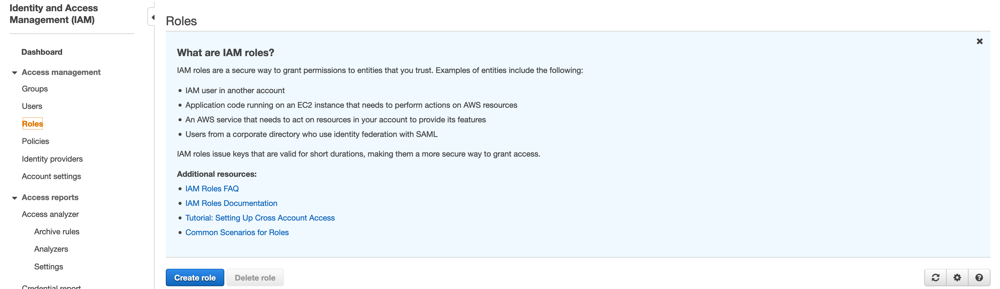
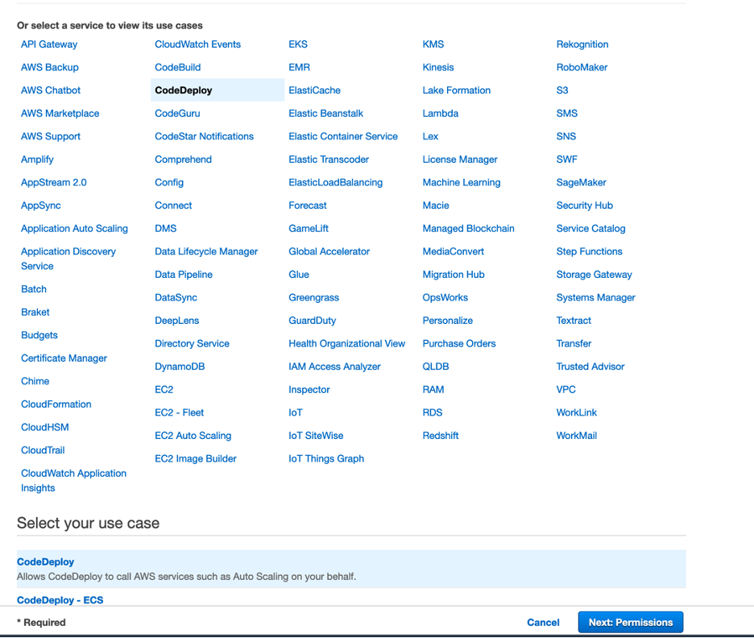
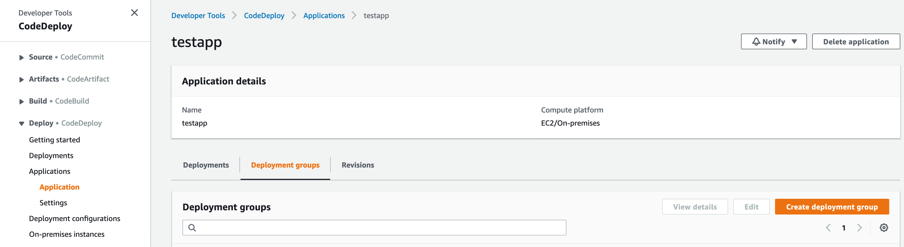
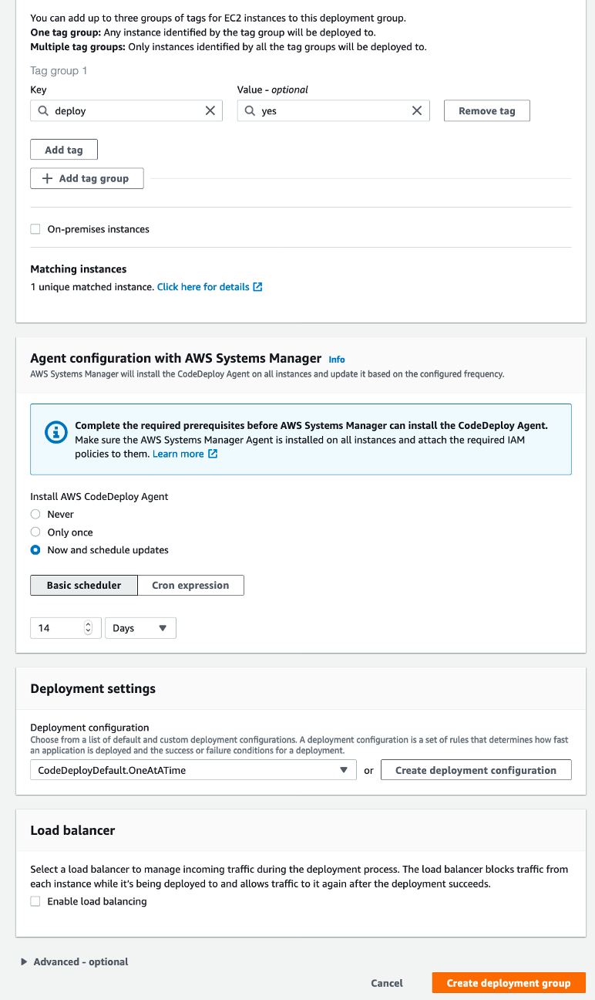
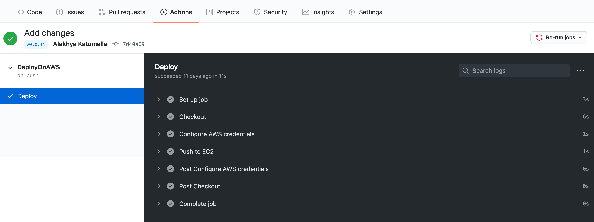

# Continuous Delivery

## Motivation

Continuous delivery (CD) refers to a process that automates software deployment from a code repository. As more teams are adopting agile software development methodologies, the code changes more frequently. Following continuous delivery practices allows the software developers to focus on application development, code testing, and security, since the deployment is automated. Additionally, the code can be improved continuously; it can be deployed reliably, with scheduled and minimal downtime.

This post introduces Github actions, explains some of the common terminology, and shows automated deployment for three mock microservices from a Github code repository to an AWS EC2 server.

## GitHub Actions

GitHub Actions is a continuous delivery product introduced by GitHub in 2019. GitHub Actions integrates seamlessly with Github. In its free tier, GitHub offers 2000 action minutes/month, which is sufficient for small to medium code bases.

## GitHub terminology

GitHub Actions allows the developer to create ```workflows``` to automatically test, build, release and deploy code. YAML files are used to define workflows and configurations. You can learn more about YAML [here](https://yaml.org/).

A workflow is an automated procedure that you can add to your repository. Workflows are made up of one or more ```jobs```. These can be scheduled, triggered by an event, or executed manually. Each job has individual tasks that are executed as part of the job, referred to as ```steps```.

Another component in a workflow is a ```runner```. A ```runner``` is a virtual machine hosted by Github on which the jobs are run. One can use GitHub hosted or self-hosted runners. You can learn more about GitHub Actions [here](https://docs.github.com/en/free-pro-team@latest/actions).


## Mock microservices
As mentioned before, we will use Actions to deploy three microservices to an [EC2](https://aws.amazon.com/ec2/?ec2-whats-new.sort-by=item.additionalFields.postDateTime&ec2-whats-new.sort-order=desc) instance. We have three mock microservices written in Go - serviceA, serverB, serverC. These three microservices communicate using HTTP REST API. In this example,

* ServiceA sends a random value between 0-10 to ```http://localhost:9000/post```

* ServerB hosts the POST endpoint at - ```http://localhost:9000/post```. B on receiving a value from A, adds a 100 and sends to it serverC.

* ServerC has two endpoints.
  * GET endpoint ```http://localhost:15000/get``` to display all the values sent.
  * POST endpoint ```http://localhost:15000/post``` to display receive the values sent. After receiving the values, serverC adds another 100 and finally adds it to the global variable.

This code can be found at the EGI Github repository [here](). 

## AWS Configuration

In AWS, we need to set up three services:

1. EC2 -  to deploy the code.
1. CodeDeploy - deployment service that facilitates easy deployment on AWS instances.
1. IAM Role - manage CodeDeploy permissions to access the EC2 server

### EC2

Let's set up the EC2 instance. 

* Under services, select EC2. If you already have an instance running, select the instance you want to use. If you still don't have a server up and running, ```Launch a new EC2 instance```. 

You can read about how to do that [here](https://docs.aws.amazon.com/quickstarts/latest/vmlaunch/step-1-launch-instance.html).

While configuring security groups, allow port 22 and 15000 access from at least your IP address.

* Now select your instance, click on the ```Tags``` tab. Click on ```Manage tags```. Assign it a meaningful tag. CodeDeploy uses this tag to find the instance.


* SSH into the EC2 server. Refer [here](https://docs.aws.amazon.com/AWSEC2/latest/UserGuide/AccessingInstances.html) on connecting to your EC2 instance.

* Install the code deployer agent on the EC2 server. Refer [here](https://docs.aws.amazon.com/codedeploy/latest/userguide/codedeploy-agent-operations-install-ubuntu.html) to read how to perform that on an Ubuntu server.

### IAM Role
The next step is to create an IAM role. We will need a role,which is assign to CodeDeploy, with permission to access the EC2 instance

* Under services, select ```IAM``` next. We will create a role with permissions to access EC2. Click on ```Roles -> Create Role```



* Select the service ```CodeDeploy```. Click on ```Next:Permissions```.



* The role should have the following policies attached. These are rather broad and should be made more specific (will be updated soon). 


**Note:** Refer [here](https://docs.aws.amazon.com/codedeploy/latest/userguide/getting-started-create-service-role.html) for more info. To know more about roles, why and how they are used, see [here](https://docs.aws.amazon.com/IAM/latest/UserGuide/id_roles.html)

### CodeDeploy Settings
AWS CodeDeploy automates your software deployments, allowing for reliable and rapid deployment. CodeDeploy can be used to deploy the application to Amazon EC2, AWS Fargate, AWS Lambda, or your on-premises servers. 

There is no additional charge for using CodeDeploy to deploy on AWS services - EC2, Lambda, Fargate. There is an additional charge when CodeDeploy is used to deploy the application on an on-premise server.

* Once you sign in to AWS, start by selecting CodeDeploy under ```Services```.


* Under CodeDeploy, Select ```Applications``` -> ```Create Application```.


* Enter the Application Name and select compute platform drop-down. This will be EC2/On-premise.


* Once you create an Application. From the Applications dashboard, click on the Application and select ```Create Deployment Group```.




* For ```Create Deployment Group```, enter the information in the form. An example is shown below,


The tag used is specified by us in the EC2 section.




* Now, once the deployment group is created successfully, click on create deployment. This step is only to grant CodeDeploy to access the GitHub Repo. 


* Select ```My application is stored in  Github```.  Give it a name, and select Connect to GitHub. 


* This opens up another tab where you might need to login to GitHub again and grant access. 


* Once you do the above, exit the window (There is no need to click on the ```Create Deployment``` button). We will trigger the deployment from GitHub.

* If this is first time that the organization is linking CodeDeploy to GitHub. There are additional steps that need to be performed on GitHub. 

  * Go to the Github Setting page.
    
    
      
  * Under your personal account, go to Applications, Authorized OAuth Apps tab. 
      
      
  
  * Click on the Application you want to grant organization access to. Click on Grant organization access. You can only do this if your GitHub admin has created a role which allows you grant permissions to third-party applications. If not, contact your administrator.
      
  
      
  * You can confirm the permissions by clicking on the ```Third-party access``` of your organization.
      
  
      
  * Finally, add your AWS user credentials with permission to access CodeDeploy to Github Secrets. 
       

* CodeDeploy deploys the application in 7 different stages. At each stage you need to provide it with a script to run. For our mock services these sit under the ```scripts/ ``` folder. The ```appspec.yml``` file is needed to specify the location of the scripts. This file also mentions the source and the destination of the executable. For this example, ApplicationStart.sh has the following information:
```shell
#!/bin/bash
/opt/app3 > /dev/null 2> /dev/null < /dev/null &
```
In this example, the executables are place in the /opt directory of the EC2 instance.

```shell
files:
  - source: /app1
    destination: /opt
```
Your, GitHub workflow is all setup now to access and deploy application using CodeDeploy. Repeat the steps for the other two services.

## Actions 

The workflow ```.yml``` files should be placed under the ```.github/workflows``` folder in the code directory. We use two workflows in this example, tests.yml, release.yml and deploy.yml. 

The ```tests.yml``` workflow runs unit tests on the go code. This workflow is triggered when code is pushed on the ```dev``` branch with the tag ```test-*```.

Job in the workflow include the following steps:

1. Checkout the code from dev (configured as default) branch.
1. Run unit tests defined in ```module_test.go ``` file using ```go test```.

```yaml
  # job name
  test:
    strategy:
      matrix:
        go-version: [1.15.x]
        # tests run on ubuntu os, macos-latest, windows-latest could also be used
        platform: [ubuntu-latest]
    runs-on: ${{ matrix.platform }}
    steps:
      - name: Install Go
        if: success()
        uses: actions/setup-go@v2
        with:
            go-version: ${{ matrix.go-version }}
      # checkout code from dev branch  
      - name: Checkout code
        uses: actions/checkout@v2

      - name: Run tests
        run: go test -v -covermode=count
```

The ```release.yml``` workflow - merges the ```dev``` branch with the ```main``` branch. This workflow is triggered manually with version number as user input.

```yaml
# Name of the workflow/action
name: Release
on:
  workflow_dispatch:
    # User inputs
    inputs:
      releaseVersion:
        description: 'Version tag'     
        required: true  
  pull_request:
```

Job in the workflow include the following steps:

1. Checkout the code from main branch
1. Merge the branch dev into main
1. Get the go dependencies using ```go get```
1. Great the go executable using ```go build```
1. Commit and push the changes on main branch with the version number

```yaml
  # job name
  release:
    name: Release on GitHub
    runs-on: ubuntu-latest
    steps:
      - name: Check out code
        uses: actions/checkout@v1
        with:
          ref: main
      
      - name: Git config and merge
        run: |
              git config --local user.email "alekhya@evergreeninnovations.co"
              git config --local user.name "alekhya@evergreeninnovations.co"
              git merge --no-ff --no-edit origin/dev

      - name: Get dependencies
        run: |
            go get -v -t -d ./...
            if [ -f Gopkg.toml ]; then
                curl https://raw.githubusercontent.com/golang/dep/master/install.sh | sh
                dep ensure
            fi
    
      - name: Validates GO releaser config
        uses: docker://goreleaser/goreleaser:latest
        with:
          args: check
      # Remove old executable
      - name: Remove old build
        run: | 
              if [ -f "app1" ]
              then
                rm app1
              fi
        shell: bash

      - name: Create local changes
        run: |
              go build -o app1
        # Change version number tag if already exists
      - name: Commit files
        run: |
              git add .
              git config --local user.email "alekhya@evergreeninnovations.co"
              git config --local user.name "alekhya@evergreeninnovations.co"
              git push origin main
              git commit -m "latest release" -a
              git tag ${{ github.event.inputs.releaseVersion }}

      - name: Push changes
        uses: ad-m/github-push-action@master
        with:
            github_token: ${{ secrets.GOBUILD_PAT }} 
            branch: main 
            tags: true
```

The push on the ```main``` with tag ```v*``` triggers the ```deploy.yml``` workflow. This trigger is defined as shown below:

```yaml
on:
  push:
    # Sequence of patterns matched against refs/tags
    tags:
    # Push events to matching v*, i.e. v1.0, v20.15.10
        - 'v*' 
```

Before reading further, please read the next section and come back to this step. Job in the workflow include the following steps:

1. Checkout the code from the main branch (same as before)
2. Configure AWS credentials
3. Push code to EC2 server
``` yaml
       - name: Configure AWS credentials
          uses: aws-actions/configure-aws-credentials@v1
          with:
            aws-access-key-id: ${{ secrets.AWS_ACCESS_KEY }}
            aws-secret-access-key: ${{ secrets.AWS_SECRET_KEY }}
            aws-region: us-east-2

        # Assuming the Deployment Group is already setup
        # explained in next section in post
        # replace with your application-name configured in code deploy
        # replace with your deployment-group-name configured in code deploy
        - name: Push to EC2
          id: deploy
          run: |
            aws deploy create-deployment \
            --application-name schedulesEndpoint \  
            --deployment-group-name schedulesEndpoint \
            --deployment-config-name CodeDeployDefault.OneAtATime \
            --github-location repository=${{ github.repository }},commitId=${{ github.sha }}
```
## Workflow in action 

To test the above, we trigger the dev branch manually. Click on the Actions tab to check the jobs running and the workflow status. 


Let's take a look at ```DeployOnAWS``` workflow. It has one job called ```Deploy```, and steps for each job are on the right.


One can look output of each step. For instance, lets look at the output for ```Test``` workflow below,


## Test the Mock Services

The mock services are now ready to be tested. 

* SSH into the EC2 server. To see how to do this refer [here](https://docs.aws.amazon.com/AWSEC2/latest/UserGuide/AccessingInstancesLinux.html).

* Navigate to the ```/opt``` folder. Your executables should be located here.


A summary of the executable for the mock services:

```
app1 (serverC) 
app2 (serverB)
app3 (serviceA)
```

* Run the app3. 

```shell
./app3
```

* Navigate to a HTTP client, such as Postman. Perform a ```/get``` on serverC. 


An example /get for the EC2 server I have running now is shown below. The link will change based on the IP address or the domain name of the server.
``` shell
http://<public dns of ec2 instance>:15000/get
```

If you cannot reach the server, check that you have added a rule to allow TCP traffic on port 15000 in the security groups.

## Comparison with Jenkins
One of most common questions we are asked are the benefits of using Github action over Jenkins. Jenkins is a widely used continuous delivery application. Although Jenkins is being used in the industry for over ten years, it adds substantial cost to the company. It adds cost of not only self-hosting and maintaining the Jenkins server, but also developer time. For most use cases, Github Actions can fulfill the criteria and perform all actions Jenkins, such as parallel jobs, container-based builds, with less overhead. If not, Jenkinsfiles can be run inside a Github actions docker container.

## Conclusion
This blog has explained the steps involved deploying applications on EC2 servers using Github Actions. Pleas contact us if you any other questions about this blog or any other DevOps topics you want us write about.
