## Outline
This blog provides a demonstration of Infrastructure as Code, where we will deploy an EC2 instance using a CloudFormation template. 

## Infrastructure as code

Infrastructure as code, also known as IaC, is a process of managing IT infrastructure through configuration files. Infrastructure as code enables developers to manage, monitor and provision resources using machine readable files. This avoids having to manually configure various hardware devices and operating systems. The code can be thought to be similar to programming scripts which are used to automate IT processes.

In the past, managing IT infrastructure was a manual, error prone, and time consuming process. Operators would physically install servers in place. The servers were then configured with the required settings and software to run an application. 

With the growth of ```cloud infrastructure```, service provider companies now have easier access to servers. However, servers still need to be provisioned and configured to run the required software. Any manual steps involved in this process can result in issues in three main areas: cost, scalability and availability. 

Automating infrastructure provisioning with IaC means that developers don’t need to manually provision and manage servers, operating systems, storage, and other infrastructure components each time an application needs to be developed or deployed. 

## What is CloudFormation?
The cloud infrastructure hosted using ```Amazon Web Services``` can be managed using an IaC software called ```CloudFormation```. Using CloudFormation, developers can define templates that describe the AWS resources such as EC2 instances or RDS. CloudFormation takes care of actually provisioning and configuring the resources based on the information in the template. 

## Terminology

```Templates``` : A CloudFormation template is text file written in JSON or YAML format. The templates inform AWS CloudFormation of the AWS resources that need to be provisioned. For example, a template can describe an EC2 instance with the AMI ID, instance size, key pair mapping, storage size, etc. 

```Stacks``` : All the resources defined in one template file are managed as a single unit called a stack. Resources can be created, updated or deleted by creating, updating, or deleting stacks.

```Change sets``` : We can make changes to the resource by updating the stack. Before a change can be made, a ```change set``` is generated. A change set describes a summary of proposed changes. They allow the developer to check how the changes being made might impact the running resources and services. Some of changes might result in downtime. For example, changing the name of an RDS instance after provisioning results in a change set where CloudFormation will create a new database and remove the old one. The result will be loss of all data in the old database unless it was backed up.

## Version control
Version control is an important part of IaC. We will use GitHub Actions to create a deployment using CloudFormation. If you are unfamiliar with GitHub Actions, the blog [here](https://www.evergreeninnovations.co/blog-continuous-delivery/) will be helpful.

To follow along with our demonstration, you will need:

1. A GitHub account
2. An AWS account

## Navigating to CloudFormation in AWS

1. Login to AWS with the credentials given to you. If you cannot access CloudFormation, check with your AWS account administrator.

2. Find ```CloudFormation``` under ```Services``` tab.

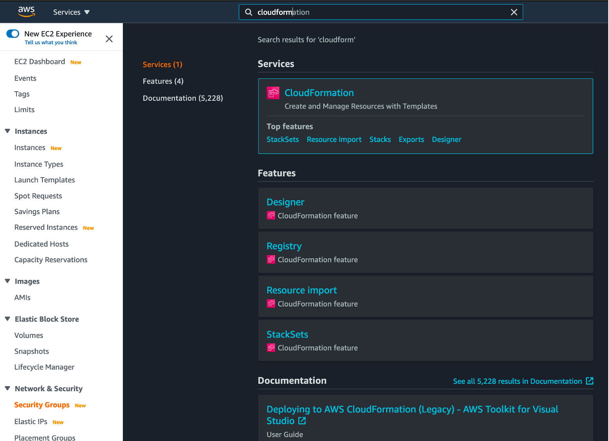

3. Click on ```Stacks``` from the menu on the left.

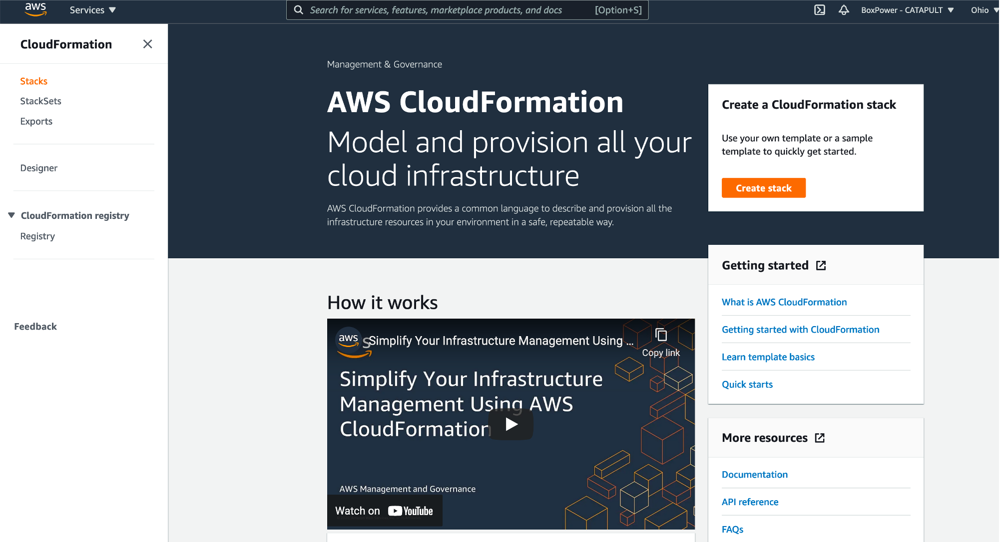

All the stacks provisioned are shown here.

## Provisioning instances using Actions

### AWS Setup
In order to provision the resources using Actions, [create an IAM User](https://github.com/evergreen-innovations/blogs/tree/master/cd-S3#iam-user) and store the AWS access key and secret key in GitHub.

To add secrets, click on the repository, ```Settings``` tab -> ```Secrets```.
    
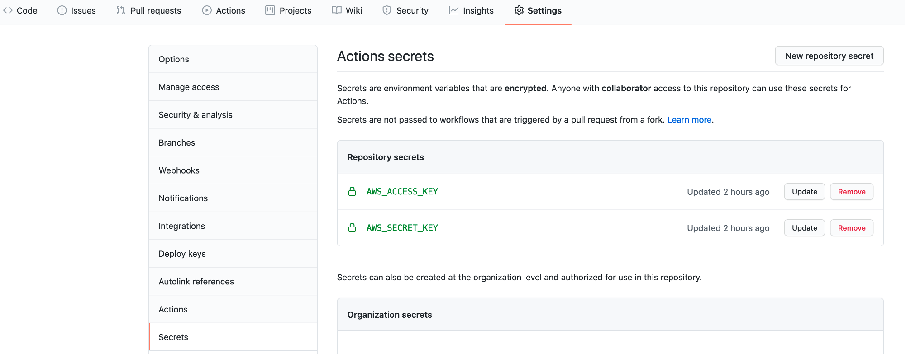

Additionally, create a key pair in AWS. To create a key pair. 

1. Under the ```Services``` tab, select ```EC2```.
2. From the EC2 Dashboard, click on ```Key Pairs``` option under ```Network & Security```.

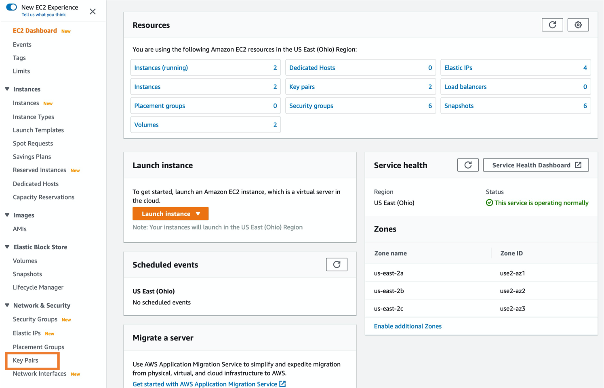

3. Click on ```Create key pair```.

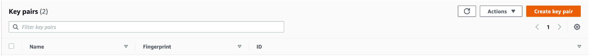

4. Give the KeyPair a name ```DemoKey```. Select the format of the download the key and save it a at a safe location.

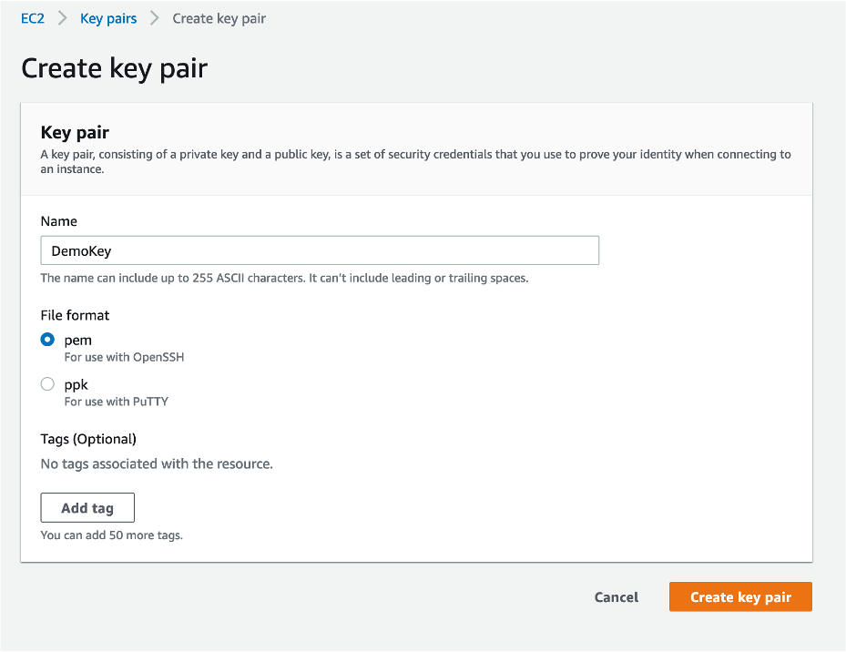

### CloudFormation template

The template ```demo.yml``` creates a new VPC. The snippet from the YAML file shown below defines the resource type. Each resource is given a set of properties. For the type ```AWS::EC2::VPC```, the required properties are ```CidrBlock``` which defines the IP CIDR range for the VPC in the AWS cloud environment. Additional properties can be defined to override the defaults as required. The complete set of documentation can be found [here](https://docs.aws.amazon.com/AWSCloudFormation/latest/UserGuide/aws-resource-ec2-vpc.html).

```yaml
  VPC:
    Type: AWS::EC2::VPC
    DeletionPolicy: Retain
    Properties:
      CidrBlock: !Ref 'VpcCIDRBlock'
      EnableDnsSupport: true
      EnableDnsHostnames: true
      InstanceTenancy: default
      Tags:
        - Key: Name
          Value: DemoVPC 
```
Also, ```demo.yml``` creates a subnet within the VPC: 
```yaml
  DemoSubnet:
    Type: AWS::EC2::Subnet
    Properties:
      AvailabilityZone: 
        Fn::Select:
          - 0
          - Fn::GetAZs: ""
      VpcId: 
        Ref: VPC
      CidrBlock: !Ref 'SubnetCIDRBlock'
      Tags:
        - Key: Name
          Value: DemoSubnet
```
defines security group rules:
```yaml
  DemoSG:
    Type: 'AWS::EC2::SecurityGroup'
    Properties:
      GroupDescription: DemoSG
      VpcId: !Ref VPC
      SecurityGroupIngress:
      - IpProtocol: tcp
        FromPort: 22
        ToPort: 22
        CidrIp: '0.0.0.0/0'
      - IpProtocol: icmpv6
        FromPort: -1
        ToPort: -1       
        CidrIp: '0.0.0.0/0'
```
and finally provisions an EC2 machine with Ubuntu 18.04:
```yaml
DemoBastionInstance:
    Type: AWS::EC2::Instance
    Properties:
      KeyName: 'DemoKey'
      ImageId: !Ref ImageID
      InstanceType: t2.micro
      NetworkInterfaces:
        - AssociatePublicIpAddress: "true"
          DeviceIndex: "0"
          GroupSet:
            - Ref: DemoSG
          SubnetId: 
            Ref: "DemoSubnet"
      UserData:
        Fn::Base64: !Sub |
                   #!/bin/bash
                   wget https://s3.amazonaws.com/amazoncloudwatch-agent/ubuntu/amd64/latest/amazon-cloudwatch-agent.deb -O /tmp/amazon-cloudwatch-agent.deb
                   dpkg -i /tmp/amazon-cloudwatch-agent.deb
                   apt-get update -y
                   apt-get  install -y python-pip
                   easy_install --script-dir /opt/aws/bin  https://s3.amazonaws.com/cloudformation-examples/aws-cfn-bootstrap-latest.tar.gz
                   /opt/aws/bin/cfn-init -v --stack ${AWS::StackId} --resource EC2Instance --region ${AWS::Region} --configsets default
                   /opt/aws/bin/cfn-signal -e $? --stack ${AWS::StackId} --resource EC2Instance --region ${AWS::Region}      
      Tags:
        - Key: Name
          Value: DemoBastionInstance
```

To run the workflow, make sure you provide the ```required``` properties for each resource.

Finally, ```Parameters``` can be used to pass variable values to the template. 

```yaml
Parameters:
  ImageID:
    Description: 'AWS Amazon Machine Image ID'
    Type: String
    Default: 'ami-063e88ad6c9af427d'
  VpcCIDRBlock:
    Description: 'CIDR Block for VPC Ex.10.0.0.0/16'
    Type: String
    Default: 10.0.0.0/16
  SubnetCIDRBlock:
    Description: 'CIDR Block for public subnet Ex.10.0.1.0/24'
    Type: String
    Default: 10.0.41.0/24
```

### GitHub Actions
We have two workflows in the repository - DeployOrModify and DeleteStack.

### DeployOrModify
This workflow can be used to deploy a new stack or modify an existing stack. 

To deploy the template, navigate to the ```Actions``` tab in GitHub and select the workflow to run. Give the inputs required or use the defaults.

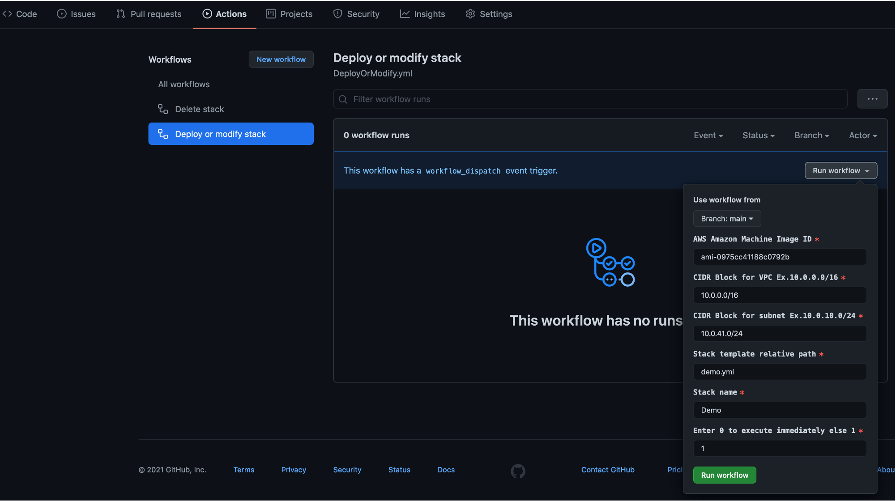    

* **AWS Amazon Machine Image ID**: The AMI ID for the EC2 server.
* **CIDR Block for VPC**: The VPC CIDR range to deploy the EC2 server in.
* **CIDR Block for subnet**: The CIDR range of the subnet where the EC2 server will be deployed. 
* **Stack template relative path**: The CloudFormation template file name to deploy/modify.
* **Stack name**: The CloudFormation stack name to deploy/modify.
* **Enter 0 to execute immediately else 1**: The value ```0``` attempts to execute the changes to the stack immediately. The value ```1``` would create a ```change set``` that can be viewed and executed from AWS CloudFormation.

Click on ```Run workflow```.

If ```1``` was entered above in ```Enter 0 to execute immediately else 1``` option, then click on the ```Stack name``` in CloudFormation ```Stacks``` list, and then click on the ```Change sets``` tab. 

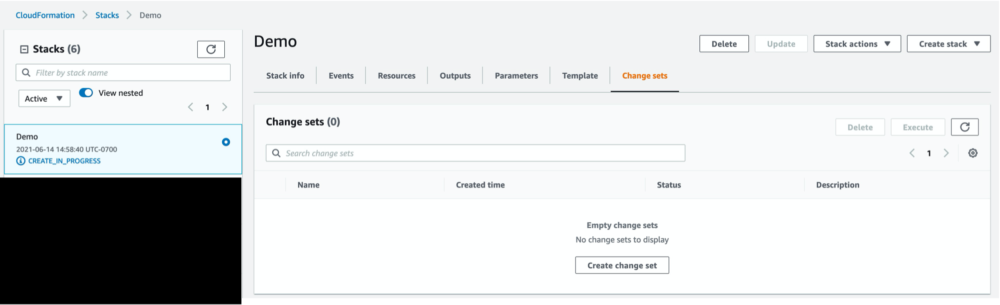    

Click on the ```Change set```, verify the changes being made to the stack, and click on ```Execute``` if the change set is as expected.

CloudFormation events and progress are shown upon selection of the stack. ```Create Complete``` indicates successful completion of changes.

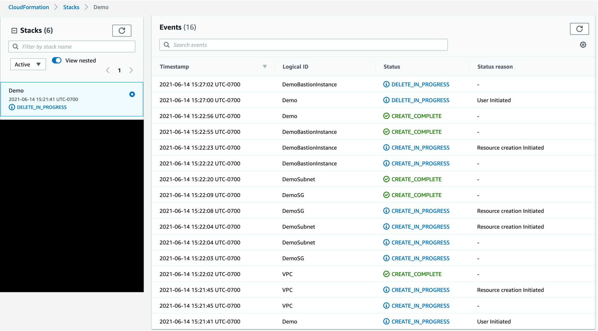  

A successful run will deploy the EC2 instance to your AWS account.

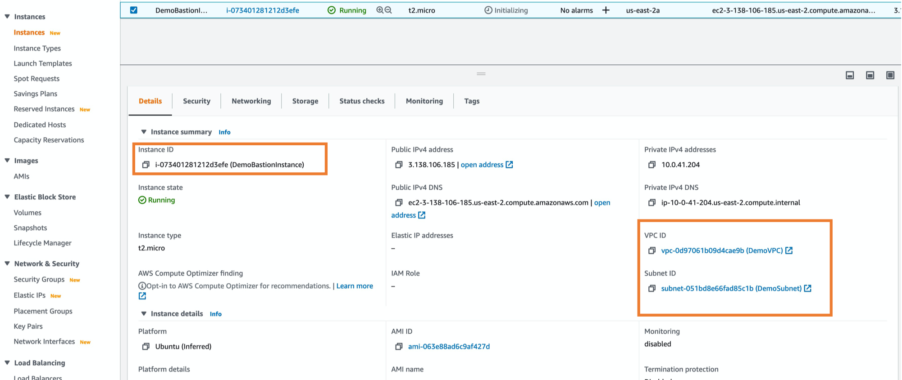    

The networking components VPC details (subnet as well as the security group) will also be created as defined in the template.

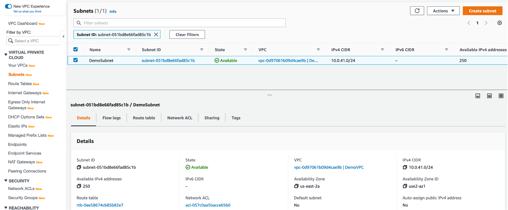  
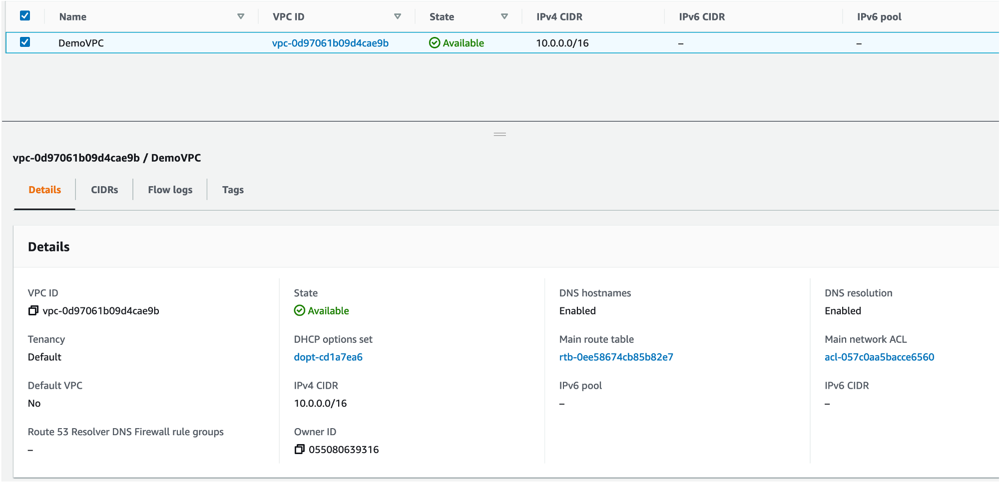  

### DeleteStack
Use the ```DeleteStack``` workflow only if you are sure that all the resources related to the stack can be deleted. To clean up the instance provisioned above, ```Run the workflow``` to remove the resources created.

## Managing drifts
Stack drift is when the template doesn't represent the state of AWS infrastructure that actually exists. Drifts can be resolved either by importing new resources or using an update action. Managing drifts is beyond the scope of this blog but it is something to be aware of as one starts managing their infrastructure using CloudFormation or any other IaC service. 

## Conclusion
This blog explained the steps involved in deploying AWS infrastructure - VPC, subnet and EC2 servers - using CloudFormation and GitHub Actions. Please contact us if you have any questions about this blog or any other DevOps topics you want us write about.
