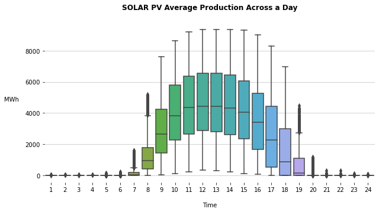

# Time Series Forecasting with Facebook Prophet
Exploring time series data and making forecasts with Facebook Prophet
- 


# Motivation 

For data scientists, data analysts, and general data enthusiasts alike, time series data and time series analysis are essential pieces in their data toolkit. In the context of our work at Evergreen Innovations, many industrial renewable energy projects heavily rely on time series data and analysis to help manage the expected flow of energy to and from the grid.

Unlike non-renewable energy sources, that can be ramped up or down based off the current load on the grid, renewable energy systems (without storage included) are at the whim of nature as to when and how much energy is produced. Due to the inability to simply control how much power a given renewable source is generating, being able to have a reliable forecast of the expected production is key.

In this blog, we will cover the essential topics for creating a time series analysis, and will be detailing how to use the [Facebook Prophet](https://facebook.github.io/prophet/) Python Package to help build the machine learning algorithm that models the trends and relationships in the data. We will use this package to make predictions of solar production values based off the input date time variable.

# What are time series data? 

Time series data, analysis, and forecasting are all centered around the idea of data points being tied to a Date or Date-Time index. Time series analysis generally relies on data being sampled at regular intervals, meaning the time between data points should be consistent across the data set. Re-sampling methods will be briefly covered when we look at the data cleaning and preparation steps for building time series forecasting.

Time series forecasting has taken on quite a few different names and shapes as the need for planning customer shopping trends, energy load, weather forecasting, etc. has increased. Some more "classic" approaches to time series modeling start with linear regression. While this method can provide some powerful insights into trends and maybe make some very general predictions, the way the mathematical calculations (in OLS regression) work, they do not encompass the complexities of real time series data.  

There are a few tricks data scientists use to help with these short comings, like sine and cosine transformations to the time series index decomposed into years, months, weeks, day of week, hour of day, ..., in order to transform the numerical relationship between the data. Simply put, sine and cosine transformation of the decomposed date time index data column (x or independent variable in yhat = A(x) + B) allow the model to understand that the 1st hour of the day "comes after" the 24th hour of the day, rather than seeing those values as "24 is greater than 1".  

Other, more powerful time series methods include ARIMA (Auto Regressive Integrated Moving Average), and SARIMA (Seasonal ARIMA) where additional seasonal trends are decomposed from the provided data in order to help the model gain the understanding of a more complex topic like seasonality and how that effects the target variable.  While those methods are both very powerful, Facebook Prophet is a preferred modeling package among many data specialists due to its ease of use, robustness to outliers and missing data points, and it's relatively fast model training and inference speed.

# Facebook Prophet 

The Facebook Prophet [documentation](https://facebook.github.io/prophet/docs/quick_start.html#python-api) is a great place to get a deeper understanding of how the modeling package works, and gives a few great general use examples. For the purpose of this blog, it's sufficient to understand that Facebook Prophet is an additive regression model with four main components including:
1. Piecewise linear or logistic growth curve trend. Prophet automatically detects changes in trends by determining change-points in the data, or the user can optionally define their own set of change-points.
1. Yearly seasonal component modeled using Fourier series.  
1. A weekly seasonal component using dummy variables.
1. A user-provided list of important holidays.

While these are the four main pillars that Prophet stands on, the greatest analyst benefit seems to be in the intuitive parameters. This topic will be covered in detail and with examples when we build and test a model later on, but is mentioned here to point out another benefit of Prophet, being able to produce a mix of fully automated forecasts and analyst-in-the-loop forecasts to generate accurate predictions for a variety of business needs.   

## Installation guide

For MacOS a typical installation sequence is:
1. Download and install Xcode from the app store
1. ```pip install cython```
1. ```pip install pystan```
1. ```pip install fbprophet```

The official documentation recommends installing via ```conda install``` with Anaconda. However, running the provided ```conda install -c conda-forge fbprophet``` has never worked for us, so we have found the above method to work the best.  Generally speaking, it's not the best idea to mix package managers like ```conda``` and ```pip```, but we have not experienced any problems with this installation method while working with other dependencies or packages yet.

# Process 
This blog will guide through the following steps:
1. [Gather Data](#Gathering-Data) 
1. [Data Cleaning and Analysis](#Data-Cleaning-and-Exploratory-Analysis)
1. [Model building and validation](#Model-Building-and-Validation) 
1. [Conclusion](#Conclusion) 

## Gathering data 
For this blog we have selected a Kaggle data set consisting of hourly production values from 2011 to 2017 from all renewable sources providing power to the CAISO (California Independent System Operator) managed grid. The CAISO grid is responsible for transmitting 80% of California's energy, as well as a small section of Nevada. We will only be forecasting total solar production, but the data set allows for a range of other analysis and forecasting opportunities related to the larger picture of energy flow through most of California. 

## Data cleaning and exploratory analysis

First, let's import our dependencies, load in our data, and get a quick feel for what the data looks like:
```python
import numpy as np
import pandas as pd
import matplotlib.pyplot as plt 

import seaborn as sns

import warnings
warnings.filterwarnings("ignore")
# lets suppress the warnings related to forward capatability with seaborn


# Read in CSV data set with Pandas 
full_data = pd.read_csv('data/all_breakdown.csv')

# Display first few rows 
display(full_data.head())


# show high level info on the data set 
display(full_data.info())
```
This will give us the following output (in jupyter notebook):

```
Data columns (total 10 columns):
 #   Column         Non-Null Count  Dtype  
---  ------         --------------  -----  
 0   TIMESTAMP      67584 non-null  object 
 1   BIOGAS         67584 non-null  float64
 2   BIOMASS        67584 non-null  float64
 3   GEOTHERMAL     67584 non-null  float64
 4   Hour           67584 non-null  float64
 5   SMALL HYDRO    67584 non-null  float64
 6   SOLAR          22680 non-null  float64
 7   SOLAR PV       44904 non-null  float64
 8   SOLAR THERMAL  44904 non-null  float64
 9   WIND TOTAL     67584 non-null  float64
dtypes: float64(9), object(1)
memory usage: 5.2+ MB
```
The valuable info is the number of NON-NULL values there are in the columns related to SOLAR production. It seems that since this data set covers a broad range of time (2011 - 2017), the nulls shown for the solar values are due to different definitions over time. It appears that solar has gone from being considered one source by CAISO to being considered two sources, depending on whether it is PV (photovoltaic) or thermal solar. With this information in hand, let's clean up the NAN values and calculate a TOTAL SOLAR column in our dataframe.  For simplicity, our forecast will be treating all solar sources as one.

```python
# fill in na values with 0 
full_data['SOLAR'] = full_data['SOLAR'].fillna(0)
full_data['SOLAR PV'] = full_data['SOLAR PV'].fillna(0)
full_data['SOLAR THERMAL'] = full_data['SOLAR THERMAL'].fillna(0)

# Create a combined column now that there are no nulls
full_data['SOLAR TOTAL'] = full_data['SOLAR']+full_data['SOLAR PV']+full_data['SOLAR THERMAL']

# Convert timestamp column to pandas datetime data type
full_data['TIMESTAMP'] = pd.to_datetime(full_data['TIMESTAMP'])
full_data['TIMESTAMP'] = pd.to_datetime(full_data['TIMESTAMP'])

# Allows us to access the "dt" property of column and included methods
full_data['MONTH'] = full_data['TIMESTAMP'].dt.month
full_data['YEAR'] = full_data['TIMESTAMP'].dt.year
full_data['DAY'] = full_data['TIMESTAMP'].dt.day
full_data['HOUR'] = full_data['TIMESTAMP'].dt.hour

full_data.info()
```
Returns:
```
Data columns (total 15 columns):
 #   Column         Non-Null Count  Dtype         
---  ------         --------------  -----         
 0   TIMESTAMP      67584 non-null  datetime64[ns]
 1   BIOGAS         67584 non-null  float64       
 2   BIOMASS        67584 non-null  float64       
 3   GEOTHERMAL     67584 non-null  float64       
 4   Hour           67584 non-null  float64       
 5   SMALL HYDRO    67584 non-null  float64       
 6   SOLAR          67584 non-null  float64       
 7   SOLAR PV       67584 non-null  float64       
 8   SOLAR THERMAL  67584 non-null  float64       
 9   WIND TOTAL     67584 non-null  float64       
 10  SOLAR TOTAL    67584 non-null  float64       
 11  MONTH          67584 non-null  int64         
 12  YEAR           67584 non-null  int64         
 13  DAY            67584 non-null  int64         
 14  HOUR           67584 non-null  int64         
dtypes: datetime64[ns](1), float64(10), int64(4)
memory usage: 7.7 MB
```
Based on this very high level understanding of our data (like the SOLAR column turning into SOLAR PV and SOLAR THERMAL in 2013), let's begin to decompose some of the trends we may expect to see in the time series data. Since we know that solar production is strongly correlated to solar irradiation, there seems to be good reason to expect some daily trends to emerge. Here is a code snippet we used to create charts to begin to explore the daily dependency of the solar production:
```python
# create some plots to look at the general daily trend in solar production 
partial_data = pd.DataFrame(full_data.loc[full_data.TIMESTAMP > pd.to_datetime('2012-12-31'),['SOLAR TOTAL','SOLAR PV','SOLAR THERMAL','Hour']])
partial_data.Hour = partial_data.Hour.map(lambda x : int(x))
for i in partial_data.columns[:-1]: #don't want to plot hour against hour, all but last column
    plt.figure(figsize=(10,5))
    sns.boxplot(partial_data['Hour'],partial_data[i])
    plt.gca().spines['top'].set_visible(False)
    plt.gca().spines['left'].set_visible(False)
    plt.gca().spines['right'].set_visible(False)
    plt.gca().spines['bottom'].set_visible(False)
    plt.gca().set_axisbelow(True)
    plt.gca().grid(axis='y',alpha=.7)

    plt.title('{} Average Production Across a Day\n'.format(i),fontweight='bold')

    plt.xlabel('\nTime')

    plt.ylabel("MWh  ",rotation='0',ha='right')
    plt.savefig('Charts/{}_average_daily_production.png'.format(i),bbox_inches = "tight")

plt.show()
```

which returns these three charts:

  

Unsurprisingly, solar power generally reflect the time of the day/solar irradiation. Perhaps a more interesting topic would be determining the cause of the large interquartile range shown on the boxplot charts. Let's take another look at the data to see if we can extract any more valuable information:

```python
## Lets take a look at the total solar production per year in the entire data set 
from pandas.plotting import register_matplotlib_converters
register_matplotlib_converters() #makes datetime work 

for year in range(2011,2019):
    data = full_data.loc[full_data['YEAR']==year,:]
    hour = data.loc[:,'Hour'].values
    mask_morning = ((hour < 9))
    mask_day = ((hour >= 9)&(hour <= 16))
    mask_evening = ((hour >16))
    x = data['TIMESTAMP']
    y = data['SOLAR TOTAL']
    plt.figure(figsize=(14,4))
    plt.scatter(x[mask_morning], y[mask_morning],c='#FF8C00',alpha=.8,label='Morning (12AM - 8AM)')
    plt.scatter(x[mask_day], y[mask_day],c='#FFD700',alpha=.7,label='Day (9AM - 6PM)')
    plt.scatter(x[mask_evening], y[mask_evening],c='#DC143C',alpha=.65,label='Evening (7PM - 11PM)')
    plt.ylim(0,y.max()*1.15)
    plt.xlim(pd.to_datetime('01/01/{}'.format(year)),pd.to_datetime('01/10/{}'.format(year+1)))
    plt.ylabel('MWh ',rotation='0',ha='right')
    plt.xlabel('Date')
    plt.title('{} Solar Production\n'.format(year))
    plt.legend(loc='upper left')
    seasons = [(pd.to_datetime('June 20, {}'.format(year)), 'Summer \nSolstice'),
           (pd.to_datetime('December 21, {}'.format(year)), 'Winter \nSolstice'),
           (pd.to_datetime('September 22, {}'.format(year)), 'Fall \nEquinox'),
           (pd.to_datetime('March 20, {}'.format(year)), 'Spring \nEquinox')]
    for date,season in seasons:
        plt.axvline(date)
        plt.text(date,y.max()*1.02,season)
    plt.savefig('Charts/{}_solar_production_seasons.png'.format(year))
    plt.show()
```
which returns several charts like these, where one should note the scale of the Y-axis and the year title across the top:


Each dot is one hour of production, color coded to the section of the day it falls into. An interesting observation includes the vast growth in hourly production from 2013 to 2017. The largest production hour in 2013 was 3,000 MWh, while in 2017 the peak production hour was nearly 10,000 MWh. The increased "Morning" and "Evening" production may indicate an increase in solar panel efficiency over the years in this data set.
 
Two final plots to help us understand the way the trends may be decomposed when building forecasts with Prophet:

```python
# Create some grouped tables for analysis and charting - we're only concerning ourselves with SOLAR TOTAL PRODUCTION 
# group to the year and month, calculate sum of total solar production, and sum of individual solar production types


import matplotlib.dates as mdates
months = mdates.MonthLocator()

chart = full_data.loc[full_data.TIMESTAMP >= pd.to_datetime('2015-01-01'),['TIMESTAMP','SOLAR TOTAL']]
chart.set_index(pd.DatetimeIndex(chart['TIMESTAMP']),inplace=True)
chart.drop(columns=['TIMESTAMP'], inplace=True)

season = chart.rolling(window=24, center=True, min_periods=20).mean().groupby(chart.index.dayofyear).mean()
q25 = chart.rolling(window=24, center=True, min_periods=20).mean().groupby(chart.index.dayofyear).quantile(.25)
q75 = chart.rolling(window=24, center=True, min_periods=20).mean().groupby(chart.index.dayofyear).quantile(.75)


f, ax = plt.subplots(figsize=(8,6))

ax.fill_between(season.index,q25.values.ravel(),q75.values.ravel(),color='#FF8C00',hatch='\\\\\\', alpha=0.45, label='Inter Quartile Range')
season.plot(ax=ax, color='#DC143C')
month_list = pd.date_range('06/01/2015','09/22/2019 23:00:00',freq='24H')
ax.set_xlabel('Day Of Year')
ax.set_ylabel('Average Renewable Production')
ax.set_title('One Day Rolling Average Renewable Prodcution')
month_names = ['Jan','Feb','Mar','Apr','May','Jun','Jul','Aug','Sep','Oct','Nov','Dec']
    
ax.set_xlabel('')
ax.xaxis.set_major_locator(months)
ax.set_xticklabels(month_names)
ax.grid(ls=':')
plt.legend()

plt.savefig('Charts/rollingAvg_solar.png')
plt.show()
```


```python
# Create a dataframe to generate a boxplot from, looking at the average production values across days and months
chart['month'] = chart.index.month
chart['hour'] = chart.index.hour

grouped = chart.groupby(['month','hour']).mean().unstack()
grouped.columns = grouped.columns.droplevel(0)

# plot the heatmap 
f, ax = plt.subplots(figsize=(12,6))
month_list = ['Jan','Feb','Mar','Apr','May','Jun','Jul']
sns.heatmap(grouped, ax=ax)
plt.savefig('Charts/solar_heatmap.png')
plt.show()
```


## Model building
First, we import dependencies,  load the data, and perform the conversions outlined above:
```python
# import dependencies
import pandas as pd 
import numpy as np
import matplotlib.pyplot as plt

# BRING IN PROPHET 
from fbprophet import Prophet 

# Read in CSV data set with Pandas 
full_data = pd.read_csv('data/all_breakdown.csv')

# fill in na values with 0 
full_data['SOLAR'] = full_data['SOLAR'].fillna(0)
full_data['SOLAR PV'] = full_data['SOLAR PV'].fillna(0)
full_data['SOLAR THERMAL'] = full_data['SOLAR THERMAL'].fillna(0)

# Create a combined columm now that there are no nulls
full_data['SOLAR TOTAL'] = full_data['SOLAR']+full_data['SOLAR PV']+full_data['SOLAR THERMAL']

# Convert timestamp column to pandas datetime data type
full_data['TIMESTAMP'] = pd.to_datetime(full_data['TIMESTAMP'])
full_data['TIMESTAMP'] = pd.to_datetime(full_data['TIMESTAMP'])

# Allows us to acces the "dt" property of column and included methods
full_data['MONTH'] = full_data['TIMESTAMP'].dt.month
full_data['YEAR'] = full_data['TIMESTAMP'].dt.year
full_data['DAY'] = full_data['TIMESTAMP'].dt.day
full_data['HOUR'] = full_data['TIMESTAMP'].dt.hour
```

Facebook Prophet expects a specific input dataframe, with a ```ds``` column and a ```y``` column. There can be more additional columns added to this dataframe, but for a baseline model, Prophet is just expecting the two columns we define.  For simplicity of testing the accuracy of the model, we will cut off the last year of data in order to see how well the model generalizes onto unknown data:
```python
# create the dataframe for fb prophet, it expects specific input dataframe
model_data = pd.DataFrame(full_data.loc[full_data.TIMESTAMP.dt.year > 2013,['TIMESTAMP', 'SOLAR TOTAL']])

model_data.columns = ['ds','y']
model_data.sort_values('ds', inplace=True)
# display is jupyter built in method for showing dataframes nicely 
display(model_data.head())
# Split off the last year as our testing year
train = model_data.loc[model_data.ds.dt.year < 2017,:]
test = model_data.loc[model_data.ds.dt.year >= 2017, :]
```


Facebook Prophet follows the SkLearn API structure, where we initialize a model and call a ```fit``` method with the training data as the data parameter:  
```python
# fit a default parameter model to the data
model = Prophet()
model.fit(train)
```
This returns a single printed line referencing the Prophet model object that was created and fit to the provided training data set:
```<fbprophet.forecaster.Prophet at 0x7ff06ee4f940>```

## Create future dataframe and plot results
To make predictions on a given time period, Prophet includes a ```make_future_dataframe``` method on the ```Prophet()``` class.  This dataframe includes the entire training data set time period, as well as a "future" time period defined by the ```periods``` and ```freq``` parameters.  Here, the future data frame will include all data from 2014 through 2016 (training data set), and the "future" will be ```365*24``` data points at a ```1H``` (one hour) frequency to make a forecasted year of hourly predictions to test against our test year of data:

```python
future = model.make_future_dataframe(periods=365*24, freq='1H')
forecast = model.predict(future)
model.plot(forecast)
plt.show()
```
which returns:


The black dots are the true values, the darker blue swath represents the predicted values, and the light blue sections are the range of the confidence intervals for the fitted values.  

While this chart is certainly helpful and valuable, it can be more instructive to plot the test and training data sets, and then plot the predicitons across the top to see how the model is generally performing at generalizing a trend:

```python
# look at it in a differnt way 
plt.figure(figsize=(15,10))

plt.scatter(train['ds'],train['y'], color='b',alpha=.55,edgecolor='w',label='Training Data True Production')
plt.scatter(test['ds'],test['y'],color='y',alpha=.55,edgecolor='w',label='Testing Data True Production')
plt.scatter(forecast['ds'],forecast['yhat'],color='r',alpha=.75,edgecolor='k',label='Predicted Production')

plt.xlim(pd.to_datetime('2014-01-01'),pd.to_datetime('2018-01-01'))
plt.ylabel('MWh Production')
plt.xlabel('Year')
plt.legend()
plt.grid(axis='y',alpha=.7)
#plt.ylim(bottom=0,top =300000)
plt.title("Predictions of Solar Power Production per Hour in California",fontweight='bold')
plt.savefig("Charts/firstPredictions.png", bbox_inches='tight')
plt.show()
```
Returns:


## Tuning the Model

There is clearly room to improve the prediction accuracy, but let's first start with redefining a training data frame. Here we define a function that returns a boolean based on the time series data column. The goal of this boolean column will be to indicate when an "on" and "off" seasonality should be applied. 

In the analysis section, it was apparent that the longer days between the Spring and Fall equinox's have a significantly different daily solar production trend than the shorter and less solar intensive winter months. During the longer days, the sun's rays are intersecting the earths atmosphere at a more perpendicular angle, which increases solar irradiation and hence production.

We also add a ```cap``` column to the data frame in order to apply a logistic growth model to the overall trend in the data. A cap column is required by Prophet for logistic growth.

```python
# tune the model
def on_season(ds):
    date = pd.to_datetime(ds)
    return ((date.month >= 3) & (date.month <= 9))


# create our own daily seasonality
model_data['on_season'] = model_data['ds'].apply(on_season)
model_data['off_season'] = ~model_data['ds'].apply(on_season) # ~ means opposite
model_data['cap'] = 11000 # for logistic growth 


model_data.y = np.cbrt(model_data.y)
model_data.cap = np.cbrt(model_data.cap)
display(model_data.head())


train = model_data.loc[model_data.ds.dt.year < 2017,:]
test = model_data.loc[model_data.ds.dt.year >= 2017, :]
```
which returns:


With that change applied, let's add some parameters to the default model to tune in the predictions. The tuning changes, along with some explanations, are as follows:
1. ```changepoint_range``` : How far into the data set does Facebook Prophet stop inferring changepoints.  The default is .8, and this parameter can have some interesting effects on the forecast generalized into the future.  Large outliers right near the end of a data set can sometimes throw off the generalized forecasted trend.
1. ```weekly_seasonality & daily_seasonality``` : of the three seasons that Prophet automatically detects and fits linear models to, the weekly seasonality is the most "human" seasonality.  Since we're modeling nature rather than people, it seems leaving it out helps improve the fit of the model.  Daily seasonality is turned off due to the on and off seasons that we have introduced above.  
1. ```yearly_seasonality``` : the number provided to default seasonality arguments in the initialization of the model is defining the number of Fourier terms that are summed to estimate the seasonality. [This image](https://en.wikipedia.org/wiki/Fourier_series#/media/File:Fourier_Series.svg) gives a good visualization of how a partial Fourier Sum can approximate an arbitrary periodic signal. A simple way to think of it is that an increased Fourier Order will allow a given seasonality to fit higher-frequency changes in the given seasonality.  
1. ```growth``` : Changes the growth solver from the default linear solver to the logistic growth trend model, and allows for a specific carrying capacity.  Determining the proper "cap" for the saturating growth takes a bit of domain knowledge, but can provide more "real world" constraints to the model.
1. ```changepoint_prior_scale``` : Determines how flexible the model is to the overall changepoints fit across the entire data set. Prophet has some complex built in logic for determining and using the inferred change points (places where the overall trend can change it's slope), and this is an easy interface to change the change point behavior.  Default value is .05, increasing it will make the trend MORE flexible, and decreasing it will make the trend LESS flexible. In other words, increasing will allow for more changepoints to be detected and used (more overall slope changes), and decreasing it will decrease the number of changes in slope in the overall trend.  We decreased this value in order to hopefully stop the model from trailing off in the "future" year and hopefully keep a more constant growth trend across the data set.  
1. ```seasonality_prior_scale``` : If seasonality is over or under fitting the data, you can adjust the seasonality prior scale to effectively dampen or increase each seasons effect.  This parameter can be set for all of the seasons in the initialization of the model, and can also be set for individual added seasonalities.  

We also define our on and off season daily seasonality. When defining a seasonality, you need a boolean column in the provided training data column in order to tell the model when that seasonality is in effect.  

```python
model = Prophet(changepoint_range=.8,weekly_seasonality=False,daily_seasonality=False,yearly_seasonality=150,
               growth='logistic',changepoint_prior_scale=.01,seasonality_prior_scale=20)

model.add_seasonality(name='on_season_daily', period=1, condition_name='on_season', fourier_order=6)
model.add_seasonality(name='off_season_daily', period=1, condition_name='off_season', fourier_order=6)

model.fit(train)
```

Create a future dataframe like above, but now we need to apply the same function to create the on and off seasons. Since the seasonality is determined by the given month, it's easy to apply the same seasonality to the "future" data.  

```python
future = model.make_future_dataframe(periods=365*24, freq='H')

future['on_season'] = future['ds'].apply(on_season)
future['off_season'] = ~future['ds'].apply(on_season)
future['cap'] = 15000
future.cap = np.cbrt(future.cap)

forecast = model.predict(future)
```

Import another Prophet package to help visualize the changes in changepoint prior scale that we made, and plot the generated forecast:
```python
from fbprophet.plot import add_changepoints_to_plot

fig = model.plot(forecast)
a = add_changepoints_to_plot(fig.gca(), model, forecast)
plt.savefig("Charts/secondModel.png", bbox_inches='tight')
plt.show()
```


Let's look at the way the trends were decomposed by the model:

```python
model.plot_components(forecast)
```
which returns:


We can now recreate the previous chart to see how the predictions have changed:

```python
train.y = train.y**3
test.y = test.y**3
forecast.yhat = forecast.yhat**3

# look at it in a differnt way 
plt.figure(figsize=(15,10))

plt.scatter(train['ds'],train['y'], color='b',alpha=.55,edgecolor='w',label='Training Data True Production')
plt.scatter(test['ds'],test['y'],color='y',alpha=.55,edgecolor='w',label='Testing Data True Production')
plt.scatter(forecast['ds'],forecast['yhat'],color='r',alpha=.75,edgecolor='k',label='Predicted Production')

plt.xlim(pd.to_datetime('2014-01-01'),pd.to_datetime('2018-01-01'))
plt.ylabel('MWh Production')
plt.xlabel('Year')
plt.legend()
plt.grid(axis='y',alpha=.7)
#plt.ylim(bottom=0,top =300000)
plt.title("Predictions of Solar Power Production per Hour in California",fontweight='bold')
plt.savefig("Charts/second_prediction.png", bbox_inches='tight')
plt.show()
```

which returns:


It seems like the model is fitting the solar production data pretty well now! To quantify the model fit:

```python
#lets get some accuracy statistics
from sklearn.metrics import r2_score, mean_absolute_error

forecastTrain = forecast.loc[forecast.ds.dt.year < 2017,:]
forecastTest = forecast.loc[forecast.ds.dt.year >= 2017,:]

# we're missing about 30 days worth of data in test data set (true data for 2017)
# so we're going to join the tables together, and fill the NA's with 0's so we can make a calculation for accuracy
forecastTest.set_index(pd.DatetimeIndex(forecastTest.ds), inplace=True)
test = test.loc[test.ds.dt.year == 2017,:]
test.set_index(pd.DatetimeIndex(test.ds), inplace=True)


testDf = forecastTest.merge(test, how='outer', right_index=True, left_index=True)
testDf.y = testDf.y.fillna(0)
testDf.yhat = testDf.yhat.fillna(0)


print("Train R2 Score: ", r2_score(train.y, forecastTrain.yhat))
print("Train MAE: ", mean_absolute_error(train.y, forecastTrain.yhat))


print("Test R2 Score: ", r2_score(testDf.y, testDf.yhat))
print("Test MAE: ", mean_absolute_error(testDf.y, testDf.yhat))
```

which gives:

```
Train R2 Score:  0.9047912458780245
Train MAE:  403.46971777595434
Test R2 Score:  0.9231201173047913
Test MAE:  552.3698339274179
```

The model is now able to explain around 90% of the variance observed in the training and testing data set, and with the scale of the data (up to 10,000 for single point) the mean absolute error of 400-600 is acceptable. Interestingly, the testing data set has a slightly greater R2 score with a larger mean absolute error, and this is likely due to a small increase in missing data points in 2017 that needed to be filled with 0's in order to be able to calculate statistics across the test data without any nulls. There are better ways to do so, particularly for data with such an strong repeating trend, which include pandas ```ffil``` and other na handling functions.  

Let's visualize the true and forecasted results in one last chart, and give some additional insights into unexpected effects from data transformations done on the training data provided to the modeling algorithm:  

```python 
import seaborn as sns
sns.jointplot(x=testDf.y, y=testDf.yhat)
plt.text(-21000,9500,s='R2: {}'.format(round(r2_score(testDf.y, testDf.yhat),3)), fontweight='bold')
plt.savefig('Charts/r2Plot.png', bbox_inches='tight')
plt.show()
```


Let's repeat this without the 0's, to dial in the R2 value and make the histograms a little more information dense:

```python
testDf = testDf.loc[testDf.y != 0]
sns.jointplot(x=testDf.y, y=testDf.yhat)
plt.text(-3000,9500,s='R2: {}'.format(round(r2_score(testDf.y, testDf.yhat),3)), fontweight='bold')
plt.savefig('Charts/r2Plot_no_0.png', bbox_inches='tight')
plt.show()
```


Finally, let's look at the test year of 2017, and group the data to make it easier to get the big picture of how well this model works. Here we will also print a few summary values to see how the model performs at an aggregate level.

```python
# lets group the data a bit to get a better feel for the accuracy of this version
plot = testDf[['y','yhat']]

plot = plot.resample('24H').sum()

plt.figure(figsize=(20,5))
plt.plot(plot.index, plot.y, label="True Production", color='b')
plt.plot(plot.index, plot.yhat, label="Predicted Production", color='r', linestyle='-')
plt.legend()
plt.title("True Vs Predicted Production Summed Per day")
plt.grid(linestyle=":")
plt.xlim(pd.to_datetime('2017-01-01'),pd.to_datetime('2018-01-01'))
plt.savefig("Charts/finalPrediction.png", bbox_inches='tight')
plt.show()


print("Predicted total 2017 Solar :", round(plot.yhat.sum() / 1000,2), "GWh")
print("True total 2017 Solar : ", round(plot.y.sum() / 1000,2), "GWh")
print("Total Year % Error : ", round(((np.abs(plot.yhat.sum() - plot.y.sum()))/ plot.y.sum()) * 100,2), "%")
```
Returns:


```
Predicted total 2017 Solar : 23405.6 GWh
True total 2017 Solar :  25270.25 GWh
Total Year % Error :  7.38 %
```

# Conclusion 

Using Facebook Prophet, we have achieved a meaningful prediction on a whole year's of solar production values, down to every hour of the year, without performing complex statistical analysis of the data, or having to manually decompose the trends and feed into the order of P, D, and Q in a SARIMA(p,d,q)(P,D,Q) (or similar) time series model.  

Some next steps, if we wanted to continue to improve the model could include the following:
1. More seasonality tuning, possibly use a gridsearch to help determine the best parameters for each seasonality and it's associated parameters.
1. Add in extra regressors.  In Facebook Prophet, a multivariate time sereies is achieved by adding in extra regressors. 
1. Using built in cross validation methods from Facebook Prophet. Prophet provides some very valuable validation methods to help data scientists better understand how their model will perform on more broad generalizations. It didn't seem needed for this blog, however it basically allows one to set some parameters around ```intial``` data size, the ```period```, and the ```horizon```. The value of this would be to more thoroughly see how your model can generalize. Using the last year of data, like we did, is a simple way to quickly get a feel for how well the model performs. However, it is also clear that the most recent year in a data set will not always represent shifts in trend that the model may have to predict when being used for real business insight or planning. Using the built in methods helps data scientists build expectations for how the model will perform under different shifts in the trend.
1. Spend some time testing Y data transformations. Cube root was used here. Log transformation, for example, is a common favorite for changing the distribution of the training data. However, for data containing 0's, log transformation isn't generally recommended (log(0) is undefined).

I hope you enjoyed this blog! Please feel free to contact us if there are other data analyst or science projects you'd like us to write about.  

